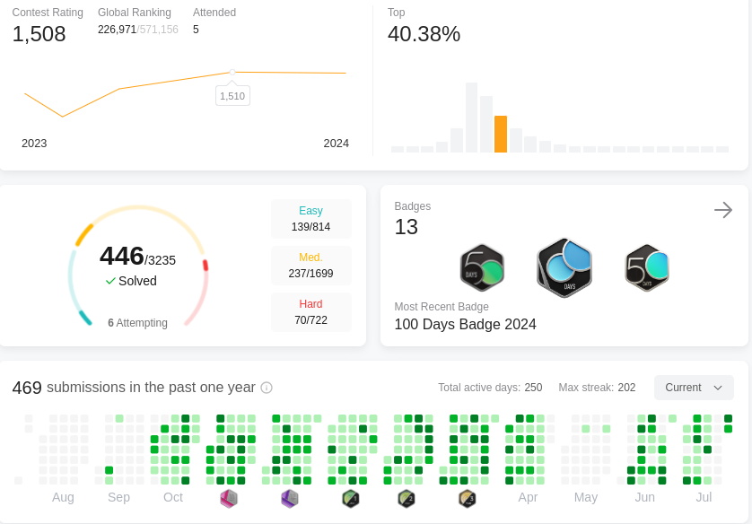

# My Leetcode Journey

## Progress

## Legend

##### 🔴 = Unable to solve/ Hard difficulty
##### 🟠 = Submission doesn't meet requirements
##### 🟡 = Submission solves problem sub-optimally/ Medium difficulty
##### 🟢 = Submission solves problem with optimal space and time complexity/ Easy difficulty

## Problems
|Dif|Problem|Attempt 1|Attempt 2|Attempt 3|Attempt 4|
|:----------:|:----------:|:----------:|:----------:|:----------:|:----------:|
|🟢|[1. Two Sum]()|🟡 Mar 01, 2022|🟢 Dec 13, 2022|🟢 Jul 08, 2023|||
|🟡|[2. Add Two Numbers]()|🟢 Dec 03, 2022|||||
|🟡|[3. Longest Substring With]()|🟢 Dec 12, 2022|||||
|🔴|[4. Median of Two Sorted A]()|🟠 Dec 12, 2022|||||
|🟡|[5. Longest Palindromic Su]()|🔴 Oct 27, 2023|||||
|🟡|[6. Zigzag Conversion]()|🟡 Dec 13, 2022|🟡 Feb 02, 2023||||
|🟡|[7. Reverse Integer]()||||||
|🟡|[8. String to Integer (at]()||||||
|🟢|[9. Palindrome Number]()||||||
|🔴|[10. Regular Expression M]()||||||
|🟡|[11. Container With Most ]()||||||
|🟡|[12. Integer to Roman]()||||||
|🟢|[13. Roman to Integer]()||||||
|🟢|[14. Longest Common Prefi]()||||||
|🟡|[15. 3Sum]()||||||
|🟡|[16. 3Sum Closest]()||||||
|🟡|[17. Letter Combinations ]()|🟢 May 13, 2024|||||
|🟡|[18. 4Sum]()||||||
|🟡|[19. Remove Nth Node From](19.cpp)|🟢 Mar 03, 2024|||||
|🟢|[20. Valid Parentheses]()|🟡 Oct 26, 2022|🟢 Apr 10, 2023||||
|🟢|[21. Merge Two Sorted Lis]()|🟢 Oct 27, 2022|||||
|🟡|[22. Generate Parentheses]()||||||
|🔴|[23. Merge k Sorted Lists]()|🟢 Mar 12, 2023|||||
|🟡|[24. Swap Nodes in Pairs]()|🔴 May 16, 2023|||||
|🔴|[25. Reverse Nodes in k-G]()||||||
|🟢|[26. Remove Duplicates fr]()||||||
|🟢|[27. Remove Element]()||||||
|🟡|[28. Find the Index of th]()|🟢 Mar 03, 2023|||||
|🟡|[29. Divide Two Integers]()||||||
|🔴|[30. Substring with Conca]()||||||
|🟡|[31. Next Permutation]()||||||
|🔴|[32. Longest Valid Parent]()||||||
|🟡|[33. Search in Rotated So]()|🔴 Dec 09, 2023|||||
|🟡|[34. Find First and Last ]()|🔴 Oct 09, 2023|||||
|🟢|[35. Search Insert Positi]()|🟠 Oct 27, 2022|🟢 Feb 20, 2023||||
|🟡|[36. Valid Sudoku]()||||||
|🔴|[37. Sudoku Solver]()||||||
|🟡|[38. Count and Say]()||||||
|🟡|[39. Combination Sum]()||||||
|🟡|[40. Combination Sum II]()||||||
|🔴|[41. First Missing Positi]()|🔴 Mar 26, 2024|||||
|🔴|[42. Trapping Rain Water]()|🔴 Apr 12, 2024|||||
|🟡|[43. Multiply Strings]()||||||
|🔴|[44. Wildcard Matching]()||||||
|🟡|[45. Jump Game II]()|🔴 Feb 08, 2023|||||
|🟡|[46. Permutations]()||||||
|🟡|[47. Permutations II]()||||||
|🟡|[48. Rotate Image]()||||||
|🟡|[49. Group Anagrams]()|🟢 Dec 13, 2022|🟢 Jul 08, 2023|🟢 Feb 06, 2024|||
|🟡|[50. Pow(x, n)]()||||||
|🔴|[51. N-Queens]()||||||
|🔴|[52. N-Queens II]()||||||
|🟡|[53. Maximum Subarray]()||||||
|🟡|[54. Spiral Matrix]()|🟠 May 09, 2023|||||
|🟡|[55. Jump Game]()|🟠 Dec 26, 2022|||||
|🟡|[56. Merge Intervals]()|🟠 Dec 09, 2022|||||
|🟡|[57. Insert Interval]()|🟡 Dec 09, 2022|🔴 Jan 16, 2023|🔴 Mar 17, 2024|||
|🟢|[58. Length of Last Word](58.cpp)|🟢 Apr 01, 2024|||||
|🟡|[59. Spiral Matrix II]()|🟢 May 10, 2023|||||
|🔴|[60. Permutation Sequence]()||||||
|🟡|[61. Rotate List]()||||||
|🟡|[62. Unique Paths]()|🟢 Nov 10, 2022|||||
|🟡|[63. Unique Paths II]()||||||
|🟡|[64. Minimum Path Sum]()|🟢 March 27, 2023|||||
|🔴|[65. Valid Number]()||||||
|🟢|[66. Plus One]()||||||
|🟢|[67. Add Binary]()|🟡 Feb 14, 2023|||||
|🔴|[68. Text Justification]()||||||
|🟢|[69. Sqrt(x)]()||||||
|🟢|[70. Climbing Stairs]()|🟢 Nov 08, 2022|🟢 Dec 12, 2022|🟢 Jan 18, 2024|||
|🟡|[71. Simplify Path]()|🔴 Apr 12, 2023|||||
|🔴|[72. Edit Distance]()|🔴 Feb 26, 2023|||||
|🟡|[73. Set Matrix Zeroes]()||||||
|🟡|[74. Search a 2D Matrix]()||||||
|🟡|[75. Sort Colors](75.cpp)|🟢 Jun 12, 2024|||||
|🔴|[76. Minimum Window Subst]()|🔴 Feb 04, 2024|||||
|🟡|[77. Combinations]()||||||
|🟡|[78. Subsets]()||||||
|🟡|[79. Word Search](79.cpp)|🟡 Apr 03, 2024|||||
|🟡|[80. Remove Duplicates fr]()||||||
|🟡|[81. Search in Rotated So]()||||||
|🟡|[82. Remove Duplicates fr]()||||||
|🟢|[83. Remove Duplicates fr]()||||||
|🔴|[84. Largest Rectangle in]()||||||
|🔴|[85. Maximal Rectangle]()|🔴 Apr 13, 2024|||||
|🟡|[86. Partition List]()||||||
|🔴|[87. Scramble String]()|🔴 Mar 30, 2023|||||
|🟢|[88. Merge Sorted Array]()||||||
|🟡|[89. Gray Code]()||||||
|🟡|[90. Subsets II]()||||||
|🟡|[91. Decode Ways]()|🔴 Dec 25, 2023|||||
|🟡|[92. Reverse Linked List ]()||||||
|🟡|[93. Restore IP Addresses]()|🔴 Jan 21, 2023|||||
|🟢|[94. Binary Tree Inorder ]()|🔴 Nov 22, 2023|🟢 Dec 09, 2023||||
|🟡|[95. Unique Binary Search]()||||||
|🟡|[96. Unique Binary Search]()||||||
|🟡|[97. Interleaving String]()||||||
|🟡|[98. Validate Binary Sear]()|🟢 Oct 27, 2022|🟢 Nov 07, 2022||||
|🟡|[99. Recover Binary Searc]()||||||
|🟢|[100. Same Tree](100.cpp)|🟢 Jan 10, 2023|🟢 Feb 26, 2024||||
|🟢|[101. Symmetric Tree]()|🟢 Mar 13, 2023|||||
|🟡|[102. Binary Tree Level O]()|🟢 Nov 06, 2022|||||
|🟡|[103. Binary Tree Zigzag ]()|🟢 Feb 19, 2023|||||
|🟢|[104. Maximum Depth of Bi]()|🟢 Feb 16, 2023|||||
|🟡|[105. Construct Binary Tr]()||||||
|🟡|[106. Construct Binary Tr]()|🔴 Mar 16, 2023|||||
|🟡|[107. Binary Tree Level O]()||||||
|🟢|[108. Convert Sorted Arra]()||||||
|🟡|[109. Convert Sorted List]()|🔴 Mar 11 , 2023|||||
|🟢|[110. Balanced Binary Tre]()||||||
|🟢|[111. Minimum Depth of Bi]()|🟢 Jul 10, 2023|||||
|🟢|[112. Path Sum]()||||||
|🟡|[113. Path Sum II]()||||||
|🟡|[114. Flatten Binary Tree]()||||||
|🔴|[115. Distinct Subsequenc]()||||||
|🟡|[116. Populating Next Rig]()||||||
|🟡|[117. Populating Next Rig]()||||||
|🟢|[118. Pascal's Triangle]()|🟢 Sep 08, 2023|||||
|🟢|[119. Pascal's Triangle I]()|🟡 Oct 16, 2023|||||
|🟡|[120. Triangle]()||||||
|🟢|[121. Best Time to Buy an]()|🟢 Nov 05, 2022|🟢 Feb 25, 2023||||
|🟡|[122. Best Time to Buy an]()||||||
|🔴|[123. Best Time to Buy an]()||||||
|🔴|[124. Binary Tree Maximum]()|🟢 Dec 11, 2022|||||
|🟢|[125. Valid Palindrome]()|🟢 Jul 16, 2023|||||
|🔴|[126. Word Ladder II]()||||||
|🔴|[127. Word Ladder]()||||||
|🟡|[128. Longest Consecutive]()|🟢 Jul 09, 2023|||||
|🟡|[129. Sum Root to Leaf Nu]()|🟢 Mar 14, 2023|🔴 Apr 15, 2024||||
|🟡|[130. Surrounded Regions]()||||||
|🟡|[131. Palindrome Partitio]()|🟠 Jan 22, 2023|||||
|🔴|[132. Palindrome Partitio]()||||||
|🟡|[133. Clone Graph]()|🔴 Apr 08, 2023|||||
|🟡|[134. Gas Station]()|🔴 Jan 07, 2023|||||
|🔴|[135. Candy]()||||||
|🟢|[136. Single Number]()||||||
|🟡|[137. Single Number II]()||||||
|🟡|[138. Copy List with Rand]()||||||
|🟡|[139. Word Break]()||||||
|🔴|[140. Word Break II]()||||||
|🟢|[141. Linked List Cycle](141.cpp)|🟢 Oct 27, 2022|🟢 Mar 06, 2024||||
|🟡|[142. Linked List Cycle I]()|🔴 Oct 27, 2022|🟢 Nov 04, 2022|🟢 Mar 09, 2023|||
|🟡|[143. Reorder List](143.cpp)|🟢 Mar 23, 2024|||||
|🟢|[144. Binary Tree Preorde]()|🟢 Jan 09, 2023|||||
|🟢|[145. Binary Tree Postord]()||||||
|🟡|[146. LRU Cache]()||||||
|🟡|[147. Insertion Sort List]()||||||
|🟡|[148. Sort List]()||||||
|🔴|[149. Max Points on a Lin]()|🟠 Jan 08, 2023|||||
|🟡|[150. Evaluate Reverse Po]()|🟢 Dec 17, 2022|🟢 Jan 30, 2024||||
|🟡|[151. Reverse Words in a ]()||||||
|🟡|[152. Maximum Product Sub]()||||||
|🟡|[153. Find Minimum in Rot]()|🟢 Dec 08, 2023|||||
|🔴|[154. Find Minimum in Rot]()||||||
|🟡|[155. Min Stack]()||||||
|🟡|[156. Binary Tree Upside ]()||||||
|🟢|[157. Read N Characters G]()||||||
|🔴|[158. Read N Characters G]()||||||
|🟡|[159. Longest Substring w]()||||||
|🟢|[160. Intersection of Two]()||||||
|🟡|[161. One Edit Distance]()||||||
|🟡|[162. Find Peak Element]()||||||
|🟢|[163. Missing Ranges]()||||||
|🔴|[164. Maximum Gap]()||||||
|🟡|[165. Compare Version Num]()||||||
|🟡|[166. Fraction to Recurri]()||||||
|🟡|[167. Two Sum II - Input ]()||||||
|🟢|[168. Excel Sheet Column ]()||||||
|🟢|[169. Majority Element]()|🟢 Feb 12, 2024|||||
|🟢|[170. Two Sum III - Data ]()||||||
|🟢|[171. Excel Sheet Column ]()||||||
|🟡|[172. Factorial Trailing ]()||||||
|🟡|[173. Binary Search Tree ]()||||||
|🔴|[174. Dungeon Game]()||||||
|🟢|[175. Combine Two Tables]()|🟢 Jan 02, 2022|||||
|🟡|[176. Second Highest Sala]()||||||
|🟡|[177. Nth Highest Salary]()||||||
|🟡|[178. Rank Scores]()|🟢 Jan 06, 2022|||||
|🟡|[179. Largest Number]()||||||
|🟡|[180. Consecutive Numbers]()|🟢 Jan 06, 2022|||||
|🟢|[181. Employees Earning M]()||||||
|🟢|[182. Duplicate Emails]()|🟢 Jan 06, 2022|||||
|🟢|[183. Customers Who Never]()|🟢 Jan 06, 2022|||||
|🟡|[184. Department Highest ]()|🟢 Jan 06, 2022|||||
|🔴|[185. Department Top Thre]()|🟢 Jan 07, 2022|||||
|🟡|[186. Reverse Words in a ]()||||||
|🟡|[187. Repeated DNA Sequen]()||||||
|🔴|[188. Best Time to Buy an]()||||||
|🟡|[189. Rotate Array]()||||||
|🟢|[190. Reverse Bits]()||||||
|🟢|[191. Number of 1 Bits]()|🟡 Nov 29, 2023|||||
|🟡|[192. Word Frequency]()||||||
|🟢|[193. Valid Phone Numbers]()||||||
|🟡|[194. Transpose File]()||||||
|🟢|[195. Tenth Line]()||||||
|🟢|[196. Delete Duplicate Em]()|🟢 Jan 06, 2022|||||
|🟢|[197. Rising Temperature]()||||||
|🟡|[198. House Robber]()|🔴 Dec 14, 2022|🟢 Jan 21, 2024||||
|🟡|[199. Binary Tree Right S]()||||||
|🟡|[200. Number of Islands](200.cpp)|🟢 Nov 07, 2022|🟢 Apr 19, 2024||||
|🟡|[201. Bitwise AND of Numb]()|🔴 Feb 21, 2024|||||
|🟢|[202. Happy Number]()||||||
|🟢|[203. Remove Linked List ]()||||||
|🟡|[204. Count Primes]()||||||
|🟢|[205. Isomorphic Strings](205.cpp)|🟢 Oct 30, 2022|🟢 Apr 02, 2024||||
|🟢|[206. Reverse Linked List](206.cpp)|🔴 Nov 02, 2022|🟢 Mar 21, 2024||||
|🟡|[207. Course Schedule]()||||||
|🟡|[208. Implement Trie (Pre]()|🔴 Mar 17, 2023|||||
|🟡|[209. Minimum Size Subarr]()||||||
|🟡|[210. Course Schedule II]()||||||
|🟡|[211. Design Add and Sear]()|🔴 Mar 19, 2023|||||
|🔴|[212. Word Search II]()||||||
|🟡|[213. House Robber II]()||||||
|🔴|[214. Shortest Palindrome]()||||||
|🟡|[215. Kth Largest Element]()||||||
|🟡|[216. Combination Sum III]()||||||
|🟢|[217. Contains Duplicate]()|🟢 Dec 13, 2022|🟢 Jul 07, 2023||||
|🔴|[218. The Skyline Problem]()||||||
|🟢|[219. Contains Duplicate ]()||||||
|🔴|[220. Contains Duplicate ]()||||||
|🟡|[221. Maximal Square]()||||||
|🟡|[222. Count Complete Tree]()||||||
|🟡|[223. Rectangle Area]()||||||
|🔴|[224. Basic Calculator]()||||||
|🟢|[225. Implement Stack usi]()||||||
|🟢|[226. Invert Binary Tree]()|🟢 Feb 18, 2023|||||
|🟡|[227. Basic Calculator II]()||||||
|🟢|[228. Summary Ranges]()||||||
|🟡|[229. Majority Element II]()|🟡 Oct 05, 2023|||||
|🟡|[230. Kth Smallest Elemen]()||||||
|🟢|[231. Power of Two]()|🟢 Dec 17, 2022|🟢 Feb 19, 2024||||
|🟢|[232. Implement Queue usi]()|🟢 Dec 16, 2022|🟢 Jan 29, 2024||||
|🔴|[233. Number of Digit One]()||||||
|🟢|[234. Palindrome Linked L](234.cpp)|🟢 Mar 22, 2024|||||
|🟡|[235. Lowest Common Ances]()|🟢 Nov 07, 2022|||||
|🟡|[236. Lowest Common Ances]()||||||
|🟡|[237. Delete Node in a Li]()||||||
|🟡|[238. Product of Array Ex](238.cpp)|🟠 Dec 17, 2022|🟢 Jan 02, 2023|🟢 Jul 09, 2023|🟢 Mar 15, 2024||
|🔴|[239. Sliding Window Maxi]()||||||
|🟡|[240. Search a 2D Matrix ]()||||||
|🟡|[241. Different Ways to A]()||||||
|🟢|[242. Valid Anagram]()|🟢 Dec 13, 2022|🟢 Jul 07, 2023|🟢 Dec 16, 2023|||
|🟢|[243. Shortest Word Dista]()||||||
|🟡|[244. Shortest Word Dista]()||||||
|🟡|[245. Shortest Word Dista]()||||||
|🟢|[246. Strobogrammatic Num]()||||||
|🟡|[247. Strobogrammatic Num]()||||||
|🔴|[248. Strobogrammatic Num]()||||||
|🟡|[249. Group Shifted Strin]()||||||
|🟡|[250. Count Univalue Subt]()||||||
|🟡|[251. Flatten 2D Vector]()||||||
|🟢|[252. Meeting Rooms]()||||||
|🟡|[253. Meeting Rooms II]()||||||
|🟡|[254. Factor Combinations]()||||||
|🟡|[255. Verify Preorder Seq]()||||||
|🟡|[256. Paint House]()||||||
|🟢|[257. Binary Tree Paths]()||||||
|🟢|[258. Add Digits]()|🟡 Apr 26, 2023|||||
|🟡|[259. 3Sum Smaller]()||||||
|🟡|[260. Single Number III]()||||||
|🟡|[261. Graph Valid Tree]()||||||
|🔴|[262. Trips and Users]()||||||
|🟢|[263. Ugly Number]()||||||
|🟡|[264. Ugly Number II]()||||||
|🔴|[265. Paint House II]()||||||
|🟢|[266. Palindrome Permutat]()||||||
|🟡|[267. Palindrome Permutat]()||||||
|🟢|[268. Missing Number]()|🟢 Feb 20, 2024|||||
|🔴|[269. Alien Dictionary]()||||||
|🟢|[270. Closest Binary Sear]()||||||
|🟡|[271. Encode and Decode S]()||||||
|🔴|[272. Closest Binary Sear]()||||||
|🔴|[273. Integer to English ]()||||||
|🟡|[274. H-Index]()||||||
|🟡|[275. H-Index II]()||||||
|🟡|[276. Paint Fence]()||||||
|🟡|[277. Find the Celebrity]()||||||
|🟢|[278. First Bad Version]()|🟠 Oct 27, 2022|🟢 Nov 06, 2022||||
|🟡|[279. Perfect Squares]()|🟡 Feb 08, 2024|||||
|🟡|[280. Wiggle Sort]()||||||
|🟡|[281. Zigzag Iterator]()||||||
|🔴|[282. Expression Add Oper]()||||||
|🟢|[283. Move Zeroes]()||||||
|🟡|[284. Peeking Iterator]()||||||
|🟡|[285. Inorder Successor i]()||||||
|🟡|[286. Walls and Gates]()||||||
|🟡|[287. Find the Duplicate ](287.cpp)|🔴 Mar 24, 2024|||||
|🟡|[288. Unique Word Abbrevi]()||||||
|🟡|[289. Game of Life]()||||||
|🟢|[290. Word Pattern]()|🟢 Jan 01, 2023|||||
|🟡|[291. Word Pattern II]()||||||
|🟢|[292. Nim Game]()||||||
|🟢|[293. Flip Game]()||||||
|🟡|[294. Flip Game II]()||||||
|🔴|[295. Find Median from Da]()||||||
|🔴|[296. Best Meeting Point]()||||||
|🔴|[297. Serialize and Deser]()||||||
|🟡|[298. Binary Tree Longest]()||||||
|🟡|[299. Bulls and Cows]()||||||
|🟡|[300. Longest Increasing ]()|🔴 Jan 05, 2024|||||
|🔴|[301. Remove Invalid Pare]()||||||
|🔴|[302. Smallest Rectangle ]()||||||
|🟢|[303. Range Sum Query - I]()||||||
|🟡|[304. Range Sum Query 2D ]()||||||
|🔴|[305. Number of Islands I]()||||||
|🟡|[306. Additive Number]()||||||
|🟡|[307. Range Sum Query - M]()||||||
|🔴|[308. Range Sum Query 2D ]()||||||
|🟡|[309. Best Time to Buy an]()|🟠 Dec 23, 2022|||||
|🟡|[310. Minimum Height Tree]()|🔴 Apr 23, 2024|||||
|🟡|[311. Sparse Matrix Multi]()||||||
|🔴|[312. Burst Balloons]()||||||
|🟡|[313. Super Ugly Number]()||||||
|🟡|[314. Binary Tree Vertica]()||||||
|🔴|[315. Count of Smaller Nu]()||||||
|🟡|[316. Remove Duplicate Le]()||||||
|🔴|[317. Shortest Distance f]()||||||
|🟡|[318. Maximum Product of ]()||||||
|🟡|[319. Bulb Switcher]()|🔴 Apr 27, 2023|||||
|🟡|[320. Generalized Abbrevi]()||||||
|🔴|[321. Create Maximum Numb]()||||||
|🟡|[322. Coin Change]()||||||
|🟡|[323. Number of Connected]()||||||
|🟡|[324. Wiggle Sort II]()||||||
|🟡|[325. Maximum Size Subarr]()||||||
|🟢|[326. Power of Three]()||||||
|🔴|[327. Count of Range Sum]()||||||
|🟡|[328. Odd Even Linked Lis]()|🟢 Dec 08, 2022|||||
|🔴|[329. Longest Increasing ]()||||||
|🔴|[330. Patching Array](330.cpp)|🟠 Jun 16, 2024|||||
|🟡|[331. Verify Preorder Ser]()||||||
|🔴|[332. Reconstruct Itinera]()||||||
|🟡|[333. Largest BST Subtree]()||||||
|🟡|[334. Increasing Triplet ]()||||||
|🔴|[335. Self Crossing]()||||||
|🔴|[336. Palindrome Pairs]()||||||
|🟡|[337. House Robber III]()||||||
|🟢|[338. Counting Bits]()||||||
|🟡|[339. Nested List Weight ]()||||||
|🟡|[340. Longest Substring w]()||||||
|🟡|[341. Flatten Nested List]()|🟢 Oct 20, 2023|||||
|🟢|[342. Power of Four]()|🟢 Oct 23, 2023|||||
|🟡|[343. Integer Break]()|🔴 Oct 06, 2023|||||
|🟢|[344. Reverse String]()||||||
|🟢|[345. Reverse Vowels of a]()||||||
|🟢|[346. Moving Average from]()||||||
|🟡|[347. Top K Frequent Elem]()|🟡 Dec 13, 2022|🟢 May 22, 2023|🟢 Jul 08, 2023|||
|🟡|[348. Design Tic-Tac-Toe]()||||||
|🟢|[349. Intersection of Two](349.cpp)|🟢 Mar 10, 2024|||||
|🟢|[350. Intersection of Two](350.cpp)|🟢 Jul 02, 2024|||||
|🟡|[351. Android Unlock Patt]()||||||
|🔴|[352. Data Stream as Disj]()|🔴 Jan 28, 2023|||||
|🟡|[353. Design Snake Game]()||||||
|🔴|[354. Russian Doll Envelo]()||||||
|🟡|[355. Design Twitter]()||||||
|🟡|[356. Line Reflection]()||||||
|🟡|[357. Count Numbers with ]()||||||
|🔴|[358. Rearrange String k ]()||||||
|🟢|[359. Logger Rate Limiter]()||||||
|🟡|[360. Sort Transformed Ar]()||||||
|🟡|[361. Bomb Enemy]()||||||
|🟡|[362. Design Hit Counter]()||||||
|🔴|[363. Max Sum of Rectangl]()||||||
|🟡|[364. Nested List Weight ]()||||||
|🟡|[365. Water and Jug Probl]()||||||
|🟡|[366. Find Leaves of Bina]()||||||
|🟢|[367. Valid Perfect Squar]()||||||
|🟡|[368. Largest Divisible S]()|🔴 Feb 09, 2024|||||
|🟡|[369. Plus One Linked Lis]()||||||
|🟡|[370. Range Addition]()||||||
|🟡|[371. Sum of Two Integers]()||||||
|🟡|[372. Super Pow]()||||||
|🟡|[373. Find K Pairs with S]()||||||
|🟢|[374. Guess Number Higher]()||||||
|🟡|[375. Guess Number Higher]()||||||
|🟡|[376. Wiggle Subsequence]()||||||
|🟡|[377. Combination Sum IV]()|🟢 Sep 09, 2023|||||
|🟡|[378. Kth Smallest Elemen]()||||||
|🟡|[379. Design Phone Direct]()||||||
|🟡|[380. Insert Delete GetRa]()|🔴 Jan 16, 2024|||||
|🔴|[381. Insert Delete GetRa]()||||||
|🟡|[382. Linked List Random ]()|🟢 Mar 10, 2023|||||
|🟢|[383. Ransom Note]()||||||
|🟡|[384. Shuffle an Array]()||||||
|🟡|[385. Mini Parser]()||||||
|🟡|[386. Lexicographical Num]()||||||
|🟢|[387. First Unique Charac]()|🟢 Feb 05, 2024|||||
|🟡|[388. Longest Absolute Fi]()||||||
|🟢|[389. Find the Difference]()||||||
|🟡|[390. Elimination Game]()||||||
|🔴|[391. Perfect Rectangle]()||||||
|🟢|[392. Is Subsequence]()|🔴 Oct 30, 2022|||||
|🟡|[393. UTF-8 Validation]()||||||
|🟡|[394. Decode String]()||||||
|🟡|[395. Longest Substring w]()||||||
|🟡|[396. Rotate Function]()||||||
|🟡|[397. Integer Replacement]()||||||
|🟡|[398. Random Pick Index]()||||||
|🟡|[399. Evaluate Division]()|🔴 May 20, 2023|||||
|🟡|[400. Nth Digit]()||||||
|🟢|[401. Binary Watch]()||||||
|🟡|[402. Remove K Digits]()|🔴 Apr 11, 2024|||||
|🔴|[403. Frog Jump]()||||||
|🟢|[404. Sum of Left Leaves](404.cpp)|🟢 Apr 14, 2024|||||
|🟢|[405. Convert a Number to]()||||||
|🟡|[406. Queue Reconstructio]()||||||
|🔴|[407. Trapping Rain Water]()||||||
|🟢|[408. Valid Word Abbrevia]()||||||
|🟢|[409. Longest Palindrome]()|🟢 Nov 05, 2022|||||
|🔴|[410. Split Array Largest]()||||||
|🔴|[411. Minimum Unique Word]()||||||
|🟢|[412. Fizz Buzz]()||||||
|🟡|[413. Arithmetic Slices]()||||||
|🟢|[414. Third Maximum Numbe]()||||||
|🟢|[415. Add Strings]()||||||
|🟡|[416. Partition Equal Sub]()||||||
|🟡|[417. Pacific Atlantic Wa]()||||||
|🟡|[418. Sentence Screen Fit]()||||||
|🟡|[419. Battleships in a Bo]()||||||
|🔴|[420. Strong Password Che]()||||||
|🟡|[421. Maximum XOR of Two ]()||||||
|🟢|[422. Valid Word Square]()||||||
|🟡|[423. Reconstruct Origina]()||||||
|🟡|[424. Longest Repeating C]()||||||
|🔴|[425. Word Squares]()||||||
|🟡|[426. Convert Binary Sear]()||||||
|🟡|[427. Construct Quad Tree]()|🔴 Feb 27, 2023|||||
|🔴|[428. Serialize and Deser]()||||||
|🟡|[429. N-ary Tree Level Or]()||||||
|🟡|[430. Flatten a Multileve]()||||||
|🔴|[431. Encode N-ary Tree t]()||||||
|🔴|[432. All O one Data Stru]()||||||
|🟡|[433. Minimum Genetic Mut]()||||||
|🟢|[434. Number of Segments ]()||||||
|🟡|[435. Non-overlapping Int]()||||||
|🟡|[436. Find Right Interval]()||||||
|🟡|[437. Path Sum III]()||||||
|🟡|[438. Find All Anagrams i]()|🟠 Nov 14, 2022|🟡 Feb 05, 2023||||
|🟡|[439. Ternary Expression ]()||||||
|🔴|[440. K-th Smallest in Le]()||||||
|🟢|[441. Arranging Coins]()||||||
|🟡|[442. Find All Duplicates]()|🔴 Mar 25, 2024|||||
|🟡|[443. String Compression]()|🔴 Mar 02, 2022|||||
|🟡|[444. Sequence Reconstruc]()||||||
|🟡|[445. Add Two Numbers II]()||||||
|🔴|[446. Arithmetic Slices I]()|🔴 Jan 07, 2024|||||
|🟡|[447. Number of Boomerang]()||||||
|🟢|[448. Find All Numbers Di]()||||||
|🟡|[449. Serialize and Deser]()||||||
|🟡|[450. Delete Node in a BS]()||||||
|🟡|[451. Sort Characters By ]()|🟡 Dec 03, 2022|🟢 Feb 07, 2024||||
|🟡|[452. Minimum Number of A]()|🔴 Jan 05, 2023|🔴 Mar 18, 2024||||
|🟡|[453. Minimum Moves to Eq]()||||||
|🟡|[454. 4Sum II]()||||||
|🟢|[455. Assign Cookies]()|🟢 Jan 01, 2024|||||
|🟡|[456. 132 Pattern]()||||||
|🟡|[457. Circular Array Loop]()||||||
|🔴|[458. Poor Pigs]()|🔴 Oct 29, 2023|||||
|🟢|[459. Repeated Substring ]()||||||
|🔴|[460. LFU Cache]()|🔴 Jan 29, 2023|||||
|🟢|[461. Hamming Distance]()||||||
|🟡|[462. Minimum Moves to Eq]()||||||
|🟢|[463. Island Perimeter](463.cpp)|🟡 Apr 18, 2024|||||
|🟡|[464. Can I Win]()||||||
|🔴|[465. Optimal Account Bal]()||||||
|🔴|[466. Count The Repetitio]()||||||
|🟡|[467. Unique Substrings i]()||||||
|🟡|[468. Validate IP Address]()||||||
|🟡|[469. Convex Polygon]()||||||
|🟡|[470. Implement Rand10() ]()||||||
|🔴|[471. Encode String with ]()||||||
|🔴|[472. Concatenated Words]()|🔴 Jan 27, 2023|||||
|🟡|[473. Matchsticks to Squa]()||||||
|🟡|[474. Ones and Zeroes]()||||||
|🟡|[475. Heaters]()||||||
|🟢|[476. Number Complement]()||||||
|🟡|[477. Total Hamming Dista]()||||||
|🟡|[478. Generate Random Poi]()||||||
|🔴|[479. Largest Palindrome ]()||||||
|🔴|[480. Sliding Window Medi]()||||||
|🟡|[481. Magical String]()||||||
|🟢|[482. License Key Formatt]()||||||
|🔴|[483. Smallest Good Base]()||||||
|🟡|[484. Find Permutation]()||||||
|🟢|[485. Max Consecutive One]()||||||
|🟡|[486. Predict the Winner]()||||||
|🟡|[487. Max Consecutive One]()||||||
|🔴|[488. Zuma Game]()||||||
|🔴|[489. Robot Room Cleaner]()||||||
|🟡|[490. The Maze]()||||||
|🟡|[491. Increasing Subseque]()|🟠 Jan 20, 2023|||||
|🟢|[492. Construct the Recta]()||||||
|🔴|[493. Reverse Pairs]()||||||
|🟡|[494. Target Sum]()||||||
|🟢|[495. Teemo Attacking]()||||||
|🟢|[496. Next Greater Elemen]()||||||
|🟡|[497. Random Point in Non]()||||||
|🟡|[498. Diagonal Traverse]()||||||
|🔴|[499. The Maze III]()||||||
|🟢|[500. Keyboard Row]()||||||
|🟢|[501. Find Mode in Binary]()|🟢 Nov 01, 2023|||||
|🔴|[502. IPO]()|🟠 Feb 23, 2023|🔴 Jun 15, 2024||||
|🟡|[503. Next Greater Elemen]()||||||
|🟢|[504. Base 7]()||||||
|🟡|[505. The Maze II]()||||||
|🟢|[506. Relative Ranks]()||||||
|🟢|[507. Perfect Number]()||||||
|🟡|[508. Most Frequent Subtr]()||||||
|🟢|[509. Fibonacci Number]()|🟡 Nov 08, 2022|||||
|🟡|[510. Inorder Successor i]()||||||
|🟢|[511. Game Play Analysis ]()||||||
|🟢|[512. Game Play Analysis ]()||||||
|🟡|[513. Find Bottom Left Tr](513.cpp)|🟢 Feb 28, 2024|||||
|🔴|[514. Freedom Trail]()|🔴 Apr 27, 2024|||||
|🟡|[515. Find Largest Value ]()|🟢 Oct 24, 2023|||||
|🟡|[516. Longest Palindromic]()|🔴 Apr 14, 2023|||||
|🔴|[517. Super Washing Machi]()||||||
|🟡|[518. Coin Change II]()||||||
|🟡|[519. Random Flip Matrix]()||||||
|🟢|[520. Detect Capital]()|🟢 Jan 02, 2023|||||
|🟢|[521. Longest Uncommon Su]()||||||
|🟡|[522. Longest Uncommon Su]()||||||
|🟡|[523. Continuous Subarray]()|🔴 Jun 08, 2024|||||
|🟡|[524. Longest Word in Dic]()||||||
|🟡|[525. Contiguous Array](525.cpp)|🟢 Mar 16, 2024|||||
|🟡|[526. Beautiful Arrangeme]()||||||
|🔴|[527. Word Abbreviation]()||||||
|🟡|[528. Random Pick with We]()||||||
|🟡|[529. Minesweeper]()||||||
|🟢|[530. Minimum Absolute Di]()||||||
|🟡|[531. Lonely Pixel I]()||||||
|🟡|[532. K-diff Pairs in an ]()||||||
|🟡|[533. Lonely Pixel II]()||||||
|🟡|[534. Game Play Analysis ]()||||||
|🟡|[535. Encode and Decode T]()||||||
|🟡|[536. Construct Binary Tr]()||||||
|🟡|[537. Complex Number Mult]()||||||
|🟡|[538. Convert BST to Grea]()||||||
|🟡|[539. Minimum Time Differ]()||||||
|🟡|[540. Single Element in a]()|🟡 Feb 21, 2023|||||
|🟢|[541. Reverse String II]()||||||
|🟡|[542. 01 Matrix]()||||||
|🟢|[543. Diameter of Binary ](543.cpp)|🟢 Feb 27, 2024|||||
|🟡|[544. Output Contest Matc]()||||||
|🟡|[545. Boundary of Binary ]()||||||
|🔴|[546. Remove Boxes]()||||||
|🟡|[547. Number of Provinces]()||||||
|🔴|[548. Split Array with Eq]()||||||
|🟡|[549. Binary Tree Longest]()||||||
|🟡|[550. Game Play Analysis ]()||||||
|🟢|[551. Student Attendance ]()||||||
|🔴|[552. Student Attendance ]()||||||
|🟡|[553. Optimal Division]()||||||
|🟡|[554. Brick Wall]()||||||
|🟡|[555. Split Concatenated ]()||||||
|🟡|[556. Next Greater Elemen]()||||||
|🟢|[557. Reverse Words in a ]()||||||
|🟡|[558. Logical OR of Two B]()||||||
|🟢|[559. Maximum Depth of N-]()||||||
|🟡|[560. Subarray Sum Equals]()||||||
|🟢|[561. Array Partition]()||||||
|🟡|[562. Longest Line of Con]()||||||
|🟢|[563. Binary Tree Tilt]()||||||
|🔴|[564. Find the Closest Pa]()||||||
|🟡|[565. Array Nesting]()||||||
|🟢|[566. Reshape the Matrix]()||||||
|🟡|[567. Permutation in Stri]()|🟠 Feb 04, 2023|||||
|🔴|[568. Maximum Vacation Da]()||||||
|🔴|[569. Median Employee Sal]()||||||
|🟡|[570. Managers with at Le]()||||||
|🔴|[571. Find Median Given F]()||||||
|🟢|[572. Subtree of Another ]()||||||
|🟡|[573. Squirrel Simulation]()||||||
|🟡|[574. Winning Candidate]()||||||
|🟢|[575. Distribute Candies]()||||||
|🟡|[576. Out of Boundary Pat]()|🔴 Jan 26, 2024|||||
|🟢|[577. Employee Bonus]()||||||
|🟡|[578. Get Highest Answer ]()||||||
|🔴|[579. Find Cumulative Sal]()||||||
|🟡|[580. Count Student Numbe]()||||||
|🟡|[581. Shortest Unsorted C]()||||||
|🟡|[582. Kill Process]()||||||
|🟡|[583. Delete Operation fo]()||||||
|🟢|[584. Find Customer Refer]()||||||
|🟡|[585. Investments in 2016]()||||||
|🟢|[586. Customer Placing th]()||||||
|🔴|[587. Erect the Fence]()||||||
|🔴|[588. Design In-Memory Fi]()||||||
|🟢|[589. N-ary Tree Preorder]()|🟢 Nov 06, 2022|||||
|🟢|[590. N-ary Tree Postorde]()||||||
|🔴|[591. Tag Validator]()||||||
|🟡|[592. Fraction Addition a]()||||||
|🟡|[593. Valid Square]()||||||
|🟢|[594. Longest Harmonious ]()||||||
|🟢|[595. Big Countries]()|🟢 Jan 06, 2022|||||
|🟢|[596. Classes More Than 5]()|🟢 Jan 06, 2022|||||
|🟢|[597. Friend Requests I: ]()||||||
|🟢|[598. Range Addition II]()||||||
|🟢|[599. Minimum Index Sum o]()||||||
|🔴|[600. Non-negative Intege]()||||||
|🔴|[601. Human Traffic of St]()|🟢 Jan 07, 2022|||||
|🟡|[602. Friend Requests II:]()||||||
|🟢|[603. Consecutive Availab]()||||||
|🟢|[604. Design Compressed S]()||||||
|🟢|[605. Can Place Flowers]()|🟢 Mar 20, 2023|||||
|🟢|[606. Construct String fr]()|🟢 Dec 08, 2023|||||
|🟢|[607. Sales Person]()||||||
|🟡|[608. Tree Node]()||||||
|🟡|[609. Find Duplicate File]()||||||
|🟢|[610. Triangle Judgement]()||||||
|🟡|[611. Valid Triangle Numb]()||||||
|🟡|[612. Shortest Distance i]()||||||
|🟢|[613. Shortest Distance i]()||||||
|🟡|[614. Second Degree Follo]()||||||
|🔴|[615. Average Salary: Dep]()||||||
|🟡|[616. Add Bold Tag in Str]()||||||
|🟢|[617. Merge Two Binary Tr]()||||||
|🔴|[618. Students Report By ]()||||||
|🟢|[619. Biggest Single Numb]()||||||
|🟢|[620. Not Boring Movies]()|🟢 Jan 06, 2022|||||
|🟡|[621. Task Scheduler]()|🔴 Mar 19, 2024|||||
|🟡|[622. Design Circular Que]()||||||
|🟡|[623. Add One Row to Tree](623.cpp)|🟢 Apr 16, 2024|||||
|🟡|[624. Maximum Distance in]()||||||
|🟡|[625. Minimum Factorizati]()||||||
|🟡|[626. Exchange Seats]()|🟢 Jan 07, 2022|||||
|🟢|[627. Swap Salary]()|🟢 Jan 06, 2022|||||
|🟢|[628. Maximum Product of ]()||||||
|🔴|[629. K Inverse Pairs Arr]()|🔴 Jan 27, 2024|||||
|🔴|[630. Course Schedule III]()||||||
|🔴|[631. Design Excel Sum Fo]()||||||
|🔴|[632. Smallest Range Cove]()||||||
|🟡|[633. Sum of Square Numbe](633.cpp)|🟡 Jun 17, 2024|||||
|🟡|[634. Find the Derangemen]()||||||
|🟡|[635. Design Log Storage ]()||||||
|🟡|[636. Exclusive Time of F]()||||||
|🟢|[637. Average of Levels i]()||||||
|🟡|[638. Shopping Offers]()||||||
|🔴|[639. Decode Ways II]()||||||
|🟡|[640. Solve the Equation]()||||||
|🟡|[641. Design Circular Deq]()||||||
|🔴|[642. Design Search Autoc]()||||||
|🟢|[643. Maximum Average Sub]()||||||
|🔴|[644. Maximum Average Sub]()||||||
|🟢|[645. Set Mismatch]()|🟢 Jan 22, 2024|||||
|🟡|[646. Maximum Length of P]()||||||
|🟡|[647. Palindromic Substri]()|🔴 Feb 10, 2024|||||
|🟡|[648. Replace Words](648.cpp)|🟡 Jun 07, 2024|||||
|🟡|[649. Dota2 Senate]()|🟡 May 04, 2023|||||
|🟡|[650. 2 Keys Keyboard]()||||||
|🟡|[651. 4 Keys Keyboard]()||||||
|🟡|[652. Find Duplicate Subt]()|🟢 Feb 28, 2023|||||
|🟢|[653. Two Sum IV - Input ]()||||||
|🟡|[654. Maximum Binary Tree]()||||||
|🟡|[655. Print Binary Tree]()||||||
|🔴|[656. Coin Path]()||||||
|🟢|[657. Robot Return to Ori]()||||||
|🟡|[658. Find K Closest Elem]()||||||
|🟡|[659. Split Array into Co]()||||||
|🔴|[660. Remove 9]()||||||
|🟢|[661. Image Smoother]()|🟢 Dec 19, 2023|||||
|🟡|[662. Maximum Width of Bi]()|🟠 Apr 20, 2023|||||
|🟡|[663. Equal Tree Partitio]()||||||
|🔴|[664. Strange Printer]()||||||
|🟡|[665. Non-decreasing Arra]()||||||
|🟡|[666. Path Sum IV]()||||||
|🟡|[667. Beautiful Arrangeme]()||||||
|🔴|[668. Kth Smallest Number]()||||||
|🟡|[669. Trim a Binary Searc]()||||||
|🟡|[670. Maximum Swap]()||||||
|🟢|[671. Second Minimum Node]()||||||
|🟡|[672. Bulb Switcher II]()||||||
|🟡|[673. Number of Longest I]()||||||
|🟢|[674. Longest Continuous ]()||||||
|🔴|[675. Cut Off Trees for G]()||||||
|🟡|[676. Implement Magic Dic]()||||||
|🟡|[677. Map Sum Pairs]()||||||
|🟡|[678. Valid Parenthesis S](678.cpp)|🟢 Apr 07, 2024|||||
|🔴|[679. 24 Game]()||||||
|🟢|[680. Valid Palindrome II]()||||||
|🟡|[681. Next Closest Time]()||||||
|🟢|[682. Baseball Game]()||||||
|🔴|[683. K Empty Slots]()||||||
|🟡|[684. Redundant Connectio]()||||||
|🔴|[685. Redundant Connectio]()||||||
|🟡|[686. Repeated String Mat]()||||||
|🟡|[687. Longest Univalue Pa]()||||||
|🟡|[688. Knight Probability ]()||||||
|🔴|[689. Maximum Sum of 3 No]()||||||
|🟡|[690. Employee Importance]()||||||
|🔴|[691. Stickers to Spell W]()||||||
|🟡|[692. Top K Frequent Word]()||||||
|🟢|[693. Binary Number with ]()||||||
|🟡|[694. Number of Distinct ]()||||||
|🟡|[695. Max Area of Island]()||||||
|🟢|[696. Count Binary Substr]()||||||
|🟢|[697. Degree of an Array]()||||||
|🟡|[698. Partition to K Equa]()||||||
|🔴|[699. Falling Squares]()||||||
|🟢|[700. Search in a Binary ]()||||||
|🟡|[701. Insert into a Binar]()||||||
|🟡|[702. Search in a Sorted ]()||||||
|🟢|[703. Kth Largest Element]()|🟢 May 23, 2023|||||
|🟢|[704. Binary Search]()|🟠 Nov 06, 2022|🟢 Apr 01, 2023||||
|🟢|[705. Design HashSet]()||||||
|🟢|[706. Design HashMap]()|🟢 Oct 04, 2023|||||
|🟡|[707. Design Linked List]()||||||
|🟡|[708. Insert into a Sorte]()||||||
|🟢|[709. To Lower Case]()||||||
|🔴|[710. Random Pick with Bl]()||||||
|🔴|[711. Number of Distinct ]()||||||
|🟡|[712. Minimum ASCII Delet]()||||||
|🟡|[713. Subarray Product Le]()|🔴 Mar 27, 2024|||||
|🟡|[714. Best Time to Buy an]()||||||
|🔴|[715. Range Module]()||||||
|🔴|[716. Max Stack]()||||||
|🟢|[717. 1-bit and 2-bit Cha]()||||||
|🟡|[718. Maximum Length of R]()||||||
|🔴|[719. Find K-th Smallest ]()||||||
|🟡|[720. Longest Word in Dic]()||||||
|🟡|[721. Accounts Merge]()||||||
|🟡|[722. Remove Comments]()||||||
|🟡|[723. Candy Crush]()||||||
|🟢|[724. Find Pivot Index]()|🟢 Oct 27, 2022|||||
|🟡|[725. Split Linked List i]()||||||
|🔴|[726. Number of Atoms]()||||||
|🔴|[727. Minimum Window Subs]()||||||
|🟢|[728. Self Dividing Numbe]()||||||
|🟡|[729. My Calendar I]()||||||
|🔴|[730. Count Different Pal]()||||||
|🟡|[731. My Calendar II]()||||||
|🔴|[732. My Calendar III]()||||||
|🟢|[733. Flood Fill]()|🟢 Nov 07, 2022|||||
|🟢|[734. Sentence Similarity]()||||||
|🟡|[735. Asteroid Collision]()||||||
|🔴|[736. Parse Lisp Expressi]()||||||
|🟡|[737. Sentence Similarity]()||||||
|🟡|[738. Monotone Increasing]()||||||
|🟡|[739. Daily Temperatures]()|🟠 Dec 17, 2022|🟢 Dec 18, 2022|🟡 Jan 31, 2024|||
|🟡|[740. Delete and Earn]()||||||
|🔴|[741. Cherry Pickup]()||||||
|🟡|[742. Closest Leaf in a B]()||||||
|🟡|[743. Network Delay Time]()||||||
|🟢|[744. Find Smallest Lette]()||||||
|🔴|[745. Prefix and Suffix S]()||||||
|🟢|[746. Min Cost Climbing S]()|🔴 Nov 09, 2022|🟢 Oct 13, 2023||||
|🟢|[747. Largest Number At L]()||||||
|🟢|[748. Shortest Completing]()||||||
|🔴|[749. Contain Virus]()||||||
|🟡|[750. Number Of Corner Re]()||||||
|🟡|[751. IP to CIDR]()||||||
|🟡|[752. Open the Lock]()|🔴 Apr 22, 2024|||||
|🔴|[753. Cracking the Safe]()||||||
|🟡|[754. Reach a Number]()||||||
|🟡|[755. Pour Water]()||||||
|🟡|[756. Pyramid Transition ]()||||||
|🔴|[757. Set Intersection Si]()||||||
|🟡|[758. Bold Words in Strin]()||||||
|🔴|[759. Employee Free Time]()||||||
|🟢|[760. Find Anagram Mappin]()||||||
|🔴|[761. Special Binary Stri]()||||||
|🟢|[762. Prime Number of Set]()||||||
|🟡|[763. Partition Labels]()||||||
|🟡|[764. Largest Plus Sign]()||||||
|🔴|[765. Couples Holding Han]()||||||
|🟢|[766. Toeplitz Matrix]()||||||
|🟡|[767. Reorganize String]()||||||
|🔴|[768. Max Chunks To Make ]()||||||
|🟡|[769. Max Chunks To Make ]()||||||
|🔴|[770. Basic Calculator IV]()||||||
|🟢|[771. Jewels and Stones]()||||||
|🔴|[772. Basic Calculator II]()||||||
|🔴|[773. Sliding Puzzle]()||||||
|🔴|[774. Minimize Max Distan]()||||||
|🟡|[775. Global and Local In]()||||||
|🟡|[776. Split BST]()||||||
|🟡|[777. Swap Adjacent in LR]()||||||
|🔴|[778. Swim in Rising Wate]()||||||
|🟡|[779. K-th Symbol in Gram]()|🔴 Oct 25, 2023|||||
|🔴|[780. Reaching Points]()||||||
|🟡|[781. Rabbits in Forest]()||||||
|🔴|[782. Transform to Chessb]()||||||
|🟢|[783. Minimum Distance Be]()|🟢 Feb 17, 2023|||||
|🟡|[784. Letter Case Permuta]()||||||
|🟡|[785. Is Graph Bipartite?]()|🟡 May 19, 2023|||||
|🟡|[786. K-th Smallest Prime]()||||||
|🟡|[787. Cheapest Flights Wi]()|🔴 Jan 26, 2023|🔴 Feb 23, 2024||||
|🟡|[788. Rotated Digits]()||||||
|🟡|[789. Escape The Ghosts]()||||||
|🟡|[790. Domino and Tromino ]()|🔴 Dec 24, 2022|||||
|🟡|[791. Custom Sort String](791.cpp)|🟢 Mar 11, 2024|||||
|🟡|[792. Number of Matching ]()||||||
|🔴|[793. Preimage Size of Fa]()||||||
|🟡|[794. Valid Tic-Tac-Toe S]()||||||
|🟡|[795. Number of Subarrays]()||||||
|🟢|[796. Rotate String]()||||||
|🟡|[797. All Paths From Sour]()|🔴 Dec 30, 2022|||||
|🔴|[798. Smallest Rotation w]()||||||
|🟡|[799. Champagne Tower]()||||||
|🟢|[800. Similar RGB Color]()||||||
|🔴|[801. Minimum Swaps To Ma]()||||||
|🟡|[802. Find Eventual Safe ]()||||||
|🔴|[803. Bricks Falling When]()||||||
|🟢|[804. Unique Morse Code W]()||||||
|🔴|[805. Split Array With Sa]()||||||
|🟢|[806. Number of Lines To ]()||||||
|🟡|[807. Max Increase to Kee]()||||||
|🟡|[808. Soup Servings]()||||||
|🟡|[809. Expressive Words]()||||||
|🔴|[810. Chalkboard XOR Game]()||||||
|🟡|[811. Subdomain Visit Cou]()||||||
|🟢|[812. Largest Triangle Ar]()||||||
|🟡|[813. Largest Sum of Aver]()||||||
|🟡|[814. Binary Tree Pruning]()||||||
|🔴|[815. Bus Routes]()|🔴 Nov 12, 2023|||||
|🟡|[816. Ambiguous Coordinat]()||||||
|🟡|[817. Linked List Compone]()||||||
|🔴|[818. Race Car]()||||||
|🟢|[819. Most Common Word]()||||||
|🟡|[820. Short Encoding of W]()||||||
|🟢|[821. Shortest Distance t]()||||||
|🟡|[822. Card Flipping Game]()||||||
|🟡|[823. Binary Trees With F]()|🔴 Oct 26, 2023|||||
|🟢|[824. Goat Latin]()||||||
|🟡|[825. Friends Of Appropri]()||||||
|🟡|[826. Most Profit Assigni]()|🔴 Jun 18, 2024|||||
|🔴|[827. Making A Large Isla]()||||||
|🔴|[828. Count Unique Charac]()||||||
|🔴|[829. Consecutive Numbers]()||||||
|🟢|[830. Positions of Large ]()||||||
|🟡|[831. Masking Personal In]()||||||
|🟢|[832. Flipping an Image]()||||||
|🟡|[833. Find And Replace in]()||||||
|🔴|[834. Sum of Distances in]()|🟢 Dec 22, 2022|🔴 Apr 28, 2024||||
|🟡|[835. Image Overlap]()||||||
|🟢|[836. Rectangle Overlap]()||||||
|🟡|[837. New 21 Game]()||||||
|🟡|[838. Push Dominoes]()||||||
|🔴|[839. Similar String Grou]()|🔴 Apr 28, 2023|||||
|🟡|[840. Magic Squares In Gr]()||||||
|🟡|[841. Keys and Rooms]()|🟢 Dec 20, 2022|||||
|🟡|[842. Split Array into Fi]()||||||
|🔴|[843. Guess the Word]()||||||
|🟢|[844. Backspace String Co]()|🟡 Oct 19, 2023|||||
|🟡|[845. Longest Mountain in]()||||||
|🟡|[846. Hand of Straights]()||||||
|🔴|[847. Shortest Path Visit]()||||||
|🟡|[848. Shifting Letters]()||||||
|🟡|[849. Maximize Distance t]()||||||
|🔴|[850. Rectangle Area II]()||||||
|🟡|[851. Loud and Rich]()||||||
|🟡|[852. Peak Index in a Mou]()||||||
|🟡|[853. Car Fleet]()||||||
|🔴|[854. K-Similar Strings]()||||||
|🟡|[855. Exam Room]()||||||
|🟡|[856. Score of Parenthese]()||||||
|🔴|[857. Minimum Cost to Hir]()||||||
|🟡|[858. Mirror Reflection]()||||||
|🟢|[859. Buddy Strings]()||||||
|🟢|[860. Lemonade Change]()||||||
|🟡|[861. Score After Flippin]()||||||
|🔴|[862. Shortest Subarray w]()||||||
|🟡|[863. All Nodes Distance ]()||||||
|🔴|[864. Shortest Path to Ge]()||||||
|🟡|[865. Smallest Subtree wi]()||||||
|🟡|[866. Prime Palindrome]()||||||
|🟢|[867. Transpose Matrix]()|🟢 Dec 10, 2023|||||
|🟢|[868. Binary Gap]()||||||
|🟡|[869. Reordered Power of ]()||||||
|🟡|[870. Advantage Shuffle]()||||||
|🔴|[871. Minimum Number of R]()||||||
|🟢|[872. Leaf-Similar Trees]()|🟢 Dec 08, 2022|🟢 Jan 09, 2024||||
|🟡|[873. Length of Longest F]()||||||
|🟡|[874. Walking Robot Simul]()||||||
|🟡|[875. Koko Eating Bananas]()|🟢 Mar 08, 2023|||||
|🟢|[876. Middle of the Linke](876.cpp)|🟢 Oct 27, 2022|🟢 Nov 02, 2022|🟢 Mar 07, 2024|||
|🟡|[877. Stone Game]()||||||
|🔴|[878. Nth Magical Number]()||||||
|🔴|[879. Profitable Schemes]()|🔴 Apr 21, 2023|||||
|🟡|[880. Decoded String at I]()||||||
|🟡|[881. Boats to Save Peopl]()|🔴 Apr 03, 2023|||||
|🔴|[882. Reachable Nodes In ]()||||||
|🟢|[883. Projection Area of ]()||||||
|🟢|[884. Uncommon Words from]()||||||
|🟡|[885. Spiral Matrix III]()||||||
|🟡|[886. Possible Bipartitio]()|🟠 Dec 21, 2022|||||
|🔴|[887. Super Egg Drop]()||||||
|🟢|[888. Fair Candy Swap]()||||||
|🟡|[889. Construct Binary Tr]()||||||
|🟡|[890. Find and Replace Pa]()||||||
|🔴|[891. Sum of Subsequence ]()||||||
|🟢|[892. Surface Area of 3D ]()||||||
|🟡|[893. Groups of Special-E]()||||||
|🟡|[894. All Possible Full B]()||||||
|🔴|[895. Maximum Frequency S]()||||||
|🟢|[896. Monotonic Array]()||||||
|🟢|[897. Increasing Order Se]()||||||
|🟡|[898. Bitwise ORs of Suba]()||||||
|🔴|[899. Orderly Queue]()||||||
|🟡|[900. RLE Iterator]()||||||
|🟡|[901. Online Stock Span]()||||||
|🔴|[902. Numbers At Most N G]()||||||
|🔴|[903. Valid Permutations ]()||||||
|🟡|[904. Fruit Into Baskets]()|🟡 Feb 07, 2023|||||
|🟢|[905. Sort Array By Parit]()||||||
|🔴|[906. Super Palindromes]()||||||
|🟡|[907. Sum of Subarray Min]()|🔴 Jan 20, 2024|||||
|🟢|[908. Smallest Range I]()||||||
|🟡|[909. Snakes and Ladders]()|🔴 Jan 24, 2023|||||
|🟡|[910. Smallest Range II]()||||||
|🟡|[911. Online Election]()||||||
|🟡|[912. Sort an Array]()|🟠 Mar 01, 2023|||||
|🔴|[913. Cat and Mouse]()||||||
|🟢|[914. X of a Kind in a De]()||||||
|🟡|[915. Partition Array int]()||||||
|🟡|[916. Word Subsets]()||||||
|🟢|[917. Reverse Only Letter]()||||||
|🟡|[918. Maximum Sum Circula]()|🟠 Jan 18, 2023|||||
|🟡|[919. Complete Binary Tre]()||||||
|🔴|[920. Number of Music Pla]()||||||
|🟡|[921. Minimum Add to Make]()||||||
|🟢|[922. Sort Array By Parit]()||||||
|🟡|[923. 3Sum With Multiplic]()||||||
|🔴|[924. Minimize Malware Sp]()||||||
|🟢|[925. Long Pressed Name]()||||||
|🟡|[926. Flip String to Mono]()|🔴 Jan 17, 2023|||||
|🔴|[927. Three Equal Parts]()||||||
|🔴|[928. Minimize Malware Sp]()||||||
|🟢|[929. Unique Email Addres]()||||||
|🟡|[930. Binary Subarrays Wi]()|🔴 Mar 14, 2024|||||
|🟡|[931. Minimum Falling Pat]()|🟡 Dec 13, 2022|🟢 Dec 16, 2022|🟢 Jan 19, 2024|||
|🟡|[932. Beautiful Array]()||||||
|🟢|[933. Number of Recent Ca]()||||||
|🟡|[934. Shortest Bridge]()|🔴 May 21, 2023|||||
|🟡|[935. Knight Dialer]()|🟠 Nov 27, 2023|||||
|🔴|[936. Stamping The Sequen]()||||||
|🟡|[937. Reorder Data in Log]()||||||
|🟢|[938. Range Sum of BST]()|🟢 Dec 07, 2022|🟢 Jan 08, 2024||||
|🟡|[939. Minimum Area Rectan]()||||||
|🔴|[940. Distinct Subsequenc]()||||||
|🟢|[941. Valid Mountain Arra]()||||||
|🟢|[942. DI String Match]()||||||
|🔴|[943. Find the Shortest S]()||||||
|🟢|[944. Delete Columns to M]()|🟢 Jan 03, 2023|||||
|🟡|[945. Minimum Increment t]()|🟠 Jun 14, 2024|||||
|🟡|[946. Validate Stack Sequ]()|🟢 Apr 13, 2023|||||
|🟡|[947. Most Stones Removed]()||||||
|🟡|[948. Bag of Tokens](948.cpp)|🟢 Mar 04, 2024|||||
|🟡|[949. Largest Time for Gi]()||||||
|🟡|[950. Reveal Cards In Inc]()|🔴 Apr 10, 2024|||||
|🟡|[951. Flip Equivalent Bin]()||||||
|🔴|[952. Largest Component S]()||||||
|🟢|[953. Verifying an Alien ]()|🟢 Feb 02, 2023|||||
|🟡|[954. Array of Doubled Pa]()||||||
|🟡|[955. Delete Columns to M]()||||||
|🔴|[956. Tallest Billboard]()||||||
|🟡|[957. Prison Cells After ]()||||||
|🟡|[958. Check Completeness ]()|🟢 Mar 15, 2023|||||
|🟡|[959. Regions Cut By Slas]()||||||
|🔴|[960. Delete Columns to M]()||||||
|🟢|[961. N-Repeated Element ]()||||||
|🟡|[962. Maximum Width Ramp]()||||||
|🟡|[963. Minimum Area Rectan]()||||||
|🔴|[964. Least Operators to ]()||||||
|🟢|[965. Univalued Binary Tr]()||||||
|🟡|[966. Vowel Spellchecker]()||||||
|🟡|[967. Numbers With Same C]()||||||
|🔴|[968. Binary Tree Cameras]()||||||
|🟡|[969. Pancake Sorting]()||||||
|🟡|[970. Powerful Integers]()||||||
|🟡|[971. Flip Binary Tree To]()||||||
|🔴|[972. Equal Rational Numb]()||||||
|🟡|[973. K Closest Points to]()||||||
|🟡|[974. Subarray Sums Divis]()|🟡 Jan 19, 2023|🔴 Jun 09, 2024||||
|🔴|[975. Odd Even Jump]()||||||
|🟢|[976. Largest Perimeter T]()||||||
|🟢|[977. Squares of a Sorted](977.cpp)|🟢 Mar 02, 2024|||||
|🟡|[978. Longest Turbulent S]()||||||
|🟡|[979. Distribute Coins in]()||||||
|🔴|[980. Unique Paths III]()|🟢 Dec 31, 2022|||||
|🟡|[981. Time Based Key-Valu]()||||||
|🔴|[982. Triples with Bitwis]()||||||
|🟡|[983. Minimum Cost For Ti]()|🔴 Mar 28, 2023|||||
|🟡|[984. String Without AAA ]()||||||
|🟡|[985. Sum of Even Numbers]()||||||
|🟡|[986. Interval List Inter]()||||||
|🔴|[987. Vertical Order Trav]()|🟢 May 27, 2024|||||
|🟡|[988. Smallest String Sta](988.cpp)|🟢 Apr 17, 2024|||||
|🟢|[989. Add to Array-Form o]()|🟡 Feb 15, 2023|||||
|🟡|[990. Satisfiability of E]()||||||
|🟡|[991. Broken Calculator]()||||||
|🔴|[992. Subarrays with K Di]()|🔴 Mar 30, 2024|||||
|🟢|[993. Cousins in Binary T]()||||||
|🟡|[994. Rotting Oranges]()||||||
|🔴|[995. Minimum Number of K]()||||||
|🔴|[996. Number of Squareful]()||||||
|🟢|[997. Find the Town Judge]()|🟡 Jan 23, 2023|🟢 Feb 22, 2024||||
|🟡|[998. Maximum Binary Tree]()||||||
|🟢|[999. Available Captures ]()||||||
|🔴|[1000. Minimum Cost to Me]()||||||
|🔴|[1001. Grid Illumination]()||||||
|🟢|[1002. Find Common Charac]()||||||
|🟡|[1003. Check If Word Is V]()||||||
|🟡|[1004. Max Consecutive On]()||||||
|🟢|[1005. Maximize Sum Of Ar]()||||||
|🟡|[1006. Clumsy Factorial]()||||||
|🟡|[1007. Minimum Domino Rot]()||||||
|🟡|[1008. Construct Binary S]()||||||
|🟢|[1009. Complement of Base]()||||||
|🟡|[1010. Pairs of Songs Wit]()||||||
|🟡|[1011. Capacity To Ship P]()|🔴 Feb 22, 2023|||||
|🔴|[1012. Numbers With Repea]()||||||
|🟢|[1013. Partition Array In]()||||||
|🟡|[1014. Best Sightseeing P]()||||||
|🟡|[1015. Smallest Integer D]()||||||
|🟡|[1016. Binary String With]()||||||
|🟡|[1017. Convert to Base -2]()||||||
|🟢|[1018. Binary Prefix Divi]()||||||
|🟡|[1019. Next Greater Node ]()||||||
|🟡|[1020. Number of Enclaves]()|🟠 Apr 07, 2023|||||
|🟢|[1021. Remove Outermost P]()||||||
|🟢|[1022. Sum of Root To Lea]()||||||
|🟡|[1023. Camelcase Matching]()||||||
|🟡|[1024. Video Stitching]()||||||
|🟢|[1025. Divisor Game]()||||||
|🟡|[1026. Maximum Difference]()|🟢 Dec 09, 2022|🟢 Jan 11, 2024||||
|🟡|[1027. Longest Arithmetic]()||||||
|🔴|[1028. Recover a Tree Fro]()||||||
|🟡|[1029. Two City Schedulin]()||||||
|🟢|[1030. Matrix Cells in Di]()||||||
|🟡|[1031. Maximum Sum of Two]()||||||
|🔴|[1032. Stream of Characte]()||||||
|🟡|[1033. Moving Stones Unti]()||||||
|🟡|[1034. Coloring A Border]()||||||
|🟡|[1035. Uncrossed Lines]()|🔴 May 11, 2023|||||
|🔴|[1036. Escape a Large Maz]()||||||
|🟢|[1037. Valid Boomerang]()||||||
|🟡|[1038. Binary Search Tree](1038.cpp)|🟢 Jun 25, 2024|||||
|🟡|[1039. Minimum Score Tria]()||||||
|🟡|[1040. Moving Stones Unti]()||||||
|🟡|[1041. Robot Bounded In C]()||||||
|🟡|[1042. Flower Planting Wi]()||||||
|🟡|[1043. Partition Array fo]()|🔴 Feb 03, 2024|||||
|🔴|[1044. Longest Duplicate ]()||||||
|🟡|[1045. Customers Who Boug]()||||||
|🟢|[1046. Last Stone Weight]()|🟢 Apr 24, 2023|||||
|🟢|[1047. Remove All Adjacen]()||||||
|🟡|[1048. Longest String Cha]()||||||
|🟡|[1049. Last Stone Weight ]()||||||
|🟢|[1050. Actors and Directo]()||||||
|🟢|[1051. Height Checker](1051.cpp)|🟢 Jun 10, 2024|||||
|🟡|[1052. Grumpy Bookstore O](1052.cpp)|🟢 Jun 21, 2024|||||
|🟡|[1053. Previous Permutati]()||||||
|🟡|[1054. Distant Barcodes]()||||||
|🟡|[1055. Shortest Way to Fo]()||||||
|🟢|[1056. Confusing Number]()||||||
|🟡|[1057. Campus Bikes]()||||||
|🟡|[1058. Minimize Rounding ]()||||||
|🟡|[1059. All Paths from Sou]()||||||
|🟡|[1060. Missing Element in]()||||||
|🟡|[1061. Lexicographically ]()|🟠 Jan 14, 2023|||||
|🟡|[1062. Longest Repeating ]()||||||
|🔴|[1063. Number of Valid Su]()||||||
|🟢|[1064. Fixed Point]()||||||
|🟢|[1065. Index Pairs of a S]()||||||
|🟡|[1066. Campus Bikes II]()||||||
|🔴|[1067. Digit Count in Ran]()||||||
|🟢|[1068. Product Sales Anal]()||||||
|🟢|[1069. Product Sales Anal]()||||||
|🟡|[1070. Product Sales Anal]()||||||
|🟢|[1071. Greatest Common Di]()|🟡 Feb 01, 2023|||||
|🟡|[1072. Flip Columns For M]()||||||
|🟡|[1073. Adding Two Negabin]()||||||
|🔴|[1074. Number of Submatri]()|🔴 Jan 28, 2024|||||
|🟢|[1075. Project Employees ]()||||||
|🟢|[1076. Project Employees ]()||||||
|🟡|[1077. Project Employees ]()||||||
|🟢|[1078. Occurrences After ]()||||||
|🟡|[1079. Letter Tile Possib]()||||||
|🟡|[1080. Insufficient Nodes]()||||||
|🟡|[1081. Smallest Subsequen]()||||||
|🟢|[1082. Sales Analysis I]()||||||
|🟢|[1083. Sales Analysis II]()||||||
|🟢|[1084. Sales Analysis III]()||||||
|🟢|[1085. Sum of Digits in t]()||||||
|🟢|[1086. High Five]()||||||
|🟡|[1087. Brace Expansion]()||||||
|🔴|[1088. Confusing Number I]()||||||
|🟢|[1089. Duplicate Zeros]()||||||
|🟡|[1090. Largest Values Fro]()||||||
|🟡|[1091. Shortest Path in B]()||||||
|🔴|[1092. Shortest Common Su]()||||||
|🟡|[1093. Statistics from a ]()||||||
|🟡|[1094. Car Pooling]()||||||
|🔴|[1095. Find in Mountain A]()|🔴 Oct 12, 2023|||||
|🔴|[1096. Brace Expansion II]()||||||
|🔴|[1097. Game Play Analysis]()||||||
|🟡|[1098. Unpopular Books]()||||||
|🟢|[1099. Two Sum Less Than ]()||||||
|🟡|[1100. Find K-Length Subs]()||||||
|🟡|[1101. The Earliest Momen]()||||||
|🟡|[1102. Path With Maximum ]()||||||
|🟢|[1103. Distribute Candies]()||||||
|🟡|[1104. Path In Zigzag Lab]()||||||
|🟡|[1105. Filling Bookcase S]()||||||
|🔴|[1106. Parsing A Boolean ]()||||||
|🟡|[1107. New Users Daily Co]()||||||
|🟢|[1108. Defanging an IP Ad]()||||||
|🟡|[1109. Corporate Flight B]()||||||
|🟡|[1110. Delete Nodes And R]()||||||
|🟡|[1111. Maximum Nesting De]()||||||
|🟡|[1112. Highest Grade For ]()||||||
|🟢|[1113. Reported Posts]()||||||
|🟢|[1114. Print in Order]()||||||
|🟡|[1115. Print FooBar Alter]()||||||
|🟡|[1116. Print Zero Even Od]()||||||
|🟡|[1117. Building H2O]()||||||
|🟢|[1118. Number of Days in ]()||||||
|🟢|[1119. Remove Vowels from]()||||||
|🟡|[1120. Maximum Average Su]()||||||
|🔴|[1121. Divide Array Into ]()||||||
|🟢|[1122. Relative Sort Arra](1122.cpp)|🟢 Jun 11, 2024|||||
|🟡|[1123. Lowest Common Ance]()||||||
|🟡|[1124. Longest Well-Perfo]()||||||
|🔴|[1125. Smallest Sufficien]()||||||
|🟡|[1126. Active Businesses]()||||||
|🔴|[1127. User Purchase Plat]()||||||
|🟢|[1128. Number of Equivale]()||||||
|🟡|[1129. Shortest Path with]()|🔴 Feb 11, 2023|||||
|🟡|[1130. Minimum Cost Tree ]()||||||
|🟡|[1131. Maximum of Absolut]()||||||
|🟡|[1132. Reported Posts II]()||||||
|🟢|[1133. Largest Unique Num]()||||||
|🟢|[1134. Armstrong Number]()||||||
|🟡|[1135. Connecting Cities ]()||||||
|🟡|[1136. Parallel Courses]()||||||
|🟢|[1137. N-th Tribonacci Nu](1137.cpp)|🟢 Jan 30, 2023|🟢 Apr 24, 2024||||
|🟡|[1138. Alphabet Board Pat]()||||||
|🟡|[1139. Largest 1-Bordered]()||||||
|🟡|[1140. Stone Game II]()||||||
|🟢|[1141. User Activity for ]()||||||
|🟢|[1142. User Activity for ]()||||||
|🟡|[1143. Longest Common Sub]()|🔴 Dec 15, 2022|🔴 Jan 25, 2024||||
|🟡|[1144. Decrease Elements ]()||||||
|🟡|[1145. Binary Tree Colori]()||||||
|🟡|[1146. Snapshot Array]()||||||
|🔴|[1147. Longest Chunked Pa]()||||||
|🟢|[1148. Article Views I]()||||||
|🟡|[1149. Article Views II]()||||||
|🟢|[1150. Check If a Number ]()||||||
|🟡|[1151. Minimum Swaps to G]()||||||
|🟡|[1152. Analyze User Websi]()||||||
|🔴|[1153. String Transforms ]()||||||
|🟢|[1154. Day of the Year]()||||||
|🟡|[1155. Number of Dice Rol]()|🟢 Dec 26, 2023|||||
|🟡|[1156. Swap For Longest R]()||||||
|🔴|[1157. Online Majority El]()||||||
|🟡|[1158. Market Analysis I]()||||||
|🔴|[1159. Market Analysis II]()||||||
|🟢|[1160. Find Words That Ca]()|🟢 Dec 02, 2023|||||
|🟡|[1161. Maximum Level Sum ]()||||||
|🟡|[1162. As Far from Land a]()|🔴 Feb 10, 2023|||||
|🔴|[1163. Last Substring in ]()||||||
|🟡|[1164. Product Price at a]()||||||
|🟢|[1165. Single-Row Keyboar]()||||||
|🟡|[1166. Design File System]()||||||
|🟡|[1167. Minimum Cost to Co]()||||||
|🔴|[1168. Optimize Water Dis]()||||||
|🟡|[1169. Invalid Transactio]()||||||
|🟡|[1170. Compare Strings by]()||||||
|🟡|[1171. Remove Zero Sum Co]()|🔴 Mar 12, 2024|||||
|🔴|[1172. Dinner Plate Stack]()||||||
|🟢|[1173. Immediate Food Del]()||||||
|🟡|[1174. Immediate Food Del]()||||||
|🟢|[1175. Prime Arrangements]()||||||
|🟢|[1176. Diet Plan Performa]()||||||
|🟡|[1177. Can Make Palindrom]()||||||
|🔴|[1178. Number of Valid Wo]()||||||
|🟢|[1179. Reformat Departmen]()|🟢 Jan 06, 2022|||||
|🟢|[1180. Count Substrings w]()||||||
|🟡|[1181. Before and After P]()||||||
|🟡|[1182. Shortest Distance ]()||||||
|🔴|[1183. Maximum Number of ]()||||||
|🟢|[1184. Distance Between B]()||||||
|🟢|[1185. Day of the Week]()||||||
|🟡|[1186. Maximum Subarray S]()||||||
|🔴|[1187. Make Array Strictl]()||||||
|🟡|[1188. Design Bounded Blo]()||||||
|🟢|[1189. Maximum Number of ]()||||||
|🟡|[1190. Reverse Substrings]()||||||
|🟡|[1191. K-Concatenation Ma]()||||||
|🔴|[1192. Critical Connectio]()||||||
|🟡|[1193. Monthly Transactio]()||||||
|🔴|[1194. Tournament Winners]()||||||
|🟡|[1195. Fizz Buzz Multithr]()||||||
|🟢|[1196. How Many Apples Ca]()||||||
|🟡|[1197. Minimum Knight Mov]()||||||
|🟡|[1198. Find Smallest Comm]()||||||
|🔴|[1199. Minimum Time to Bu]()||||||
|🟢|[1200. Minimum Absolute D]()||||||
|🟡|[1201. Ugly Number III]()||||||
|🟡|[1202. Smallest String Wi]()||||||
|🔴|[1203. Sort Items by Grou]()||||||
|🟡|[1204. Last Person to Fit]()||||||
|🟡|[1205. Monthly Transactio]()||||||
|🔴|[1206. Design Skiplist]()||||||
|🟢|[1207. Unique Number of O]()|🔴 Nov 30, 2022|🟢 Jan 17, 2024||||
|🟡|[1208. Get Equal Substrin]()||||||
|🟡|[1209. Remove All Adjacen]()||||||
|🔴|[1210. Minimum Moves to R]()||||||
|🟢|[1211. Queries Quality an]()||||||
|🟡|[1212. Team Scores in Foo]()||||||
|🟢|[1213. Intersection of Th]()||||||
|🟡|[1214. Two Sum BSTs]()||||||
|🟡|[1215. Stepping Numbers]()||||||
|🔴|[1216. Valid Palindrome I]()||||||
|🟢|[1217. Minimum Cost to Mo]()||||||
|🟡|[1218. Longest Arithmetic]()||||||
|🟡|[1219. Path with Maximum ]()||||||
|🔴|[1220. Count Vowels Permu]()|🟡 Oct 28, 2023|||||
|🟢|[1221. Split a String in ]()||||||
|🟡|[1222. Queens That Can At]()||||||
|🔴|[1223. Dice Roll Simulati]()||||||
|🔴|[1224. Maximum Equal Freq]()||||||
|🔴|[1225. Report Contiguous ]()||||||
|🟡|[1226. The Dining Philoso]()||||||
|🟡|[1227. Airplane Seat Assi]()||||||
|🟢|[1228. Missing Number In ]()||||||
|🟡|[1229. Meeting Scheduler]()||||||
|🟡|[1230. Toss Strange Coins]()||||||
|🔴|[1231. Divide Chocolate]()||||||
|🟢|[1232. Check If It Is a S]()||||||
|🟡|[1233. Remove Sub-Folders]()||||||
|🟡|[1234. Replace the Substr]()||||||
|🔴|[1235. Maximum Profit in ]()|🔴 Jan 06, 2024|||||
|🟡|[1236. Web Crawler]()||||||
|🟡|[1237. Find Positive Inte]()||||||
|🟡|[1238. Circular Permutati]()||||||
|🟡|[1239. Maximum Length of ]()|🔴 Jan 23, 2024|||||
|🔴|[1240. Tiling a Rectangle]()||||||
|🟢|[1241. Number of Comments]()||||||
|🟡|[1242. Web Crawler Multit]()||||||
|🟢|[1243. Array Transformati]()||||||
|🟡|[1244. Design A Leaderboa]()||||||
|🟡|[1245. Tree Diameter]()||||||
|🔴|[1246. Palindrome Removal]()||||||
|🟡|[1247. Minimum Swaps to M]()||||||
|🟡|[1248. Count Number of Ni]()||||||
|🟡|[1249. Minimum Remove to ](1249.cpp)|🟢 Apr 06, 2024|||||
|🔴|[1250. Check If It Is a G]()||||||
|🟢|[1251. Average Selling Pr]()||||||
|🟢|[1252. Cells with Odd Val]()||||||
|🟡|[1253. Reconstruct a 2-Ro]()||||||
|🟡|[1254. Number of Closed I]()|🟢 Apr 06, 2023|||||
|🔴|[1255. Maximum Score Word]()||||||
|🟡|[1256. Encode Number]()||||||
|🟡|[1257. Smallest Common Re]()||||||
|🟡|[1258. Synonymous Sentenc]()||||||
|🔴|[1259. Handshakes That Do]()||||||
|🟢|[1260. Shift 2D Grid]()||||||
|🟡|[1261. Find Elements in a]()||||||
|🟡|[1262. Greatest Sum Divis]()||||||
|🔴|[1263. Minimum Moves to M]()||||||
|🟡|[1264. Page Recommendatio]()||||||
|🟡|[1265. Print Immutable Li]()||||||
|🟢|[1266. Minimum Time Visit]()|🟢 Dec 03, 2023|||||
|🟡|[1267. Count Servers that]()||||||
|🟡|[1268. Search Suggestions]()||||||
|🔴|[1269. Number of Ways to ]()|🔴 Oct 15, 2023|||||
|🟡|[1270. All People Report ]()||||||
|🟢|[1271. Hexspeak]()||||||
|🟡|[1272. Remove Interval]()||||||
|🟡|[1273. Delete Tree Nodes]()||||||
|🔴|[1274. Number of Ships in]()||||||
|🟢|[1275. Find Winner on a T]()||||||
|🟡|[1276. Number of Burgers ]()||||||
|🟡|[1277. Count Square Subma]()||||||
|🔴|[1278. Palindrome Partiti]()||||||
|🟢|[1279. Traffic Light Cont]()||||||
|🟢|[1280. Students and Exami]()||||||
|🟢|[1281. Subtract the Produ]()||||||
|🟡|[1282. Group the People G]()||||||
|🟡|[1283. Find the Smallest ]()||||||
|🔴|[1284. Minimum Number of ]()||||||
|🟡|[1285. Find the Start and]()||||||
|🟡|[1286. Iterator for Combi]()||||||
|🟢|[1287. Element Appearing ]()|🟢 Dec 11, 2023|||||
|🟡|[1288. Remove Covered Int]()||||||
|🔴|[1289. Minimum Falling Pa]()|🔴 Apr 26, 2024|||||
|🟢|[1290. Convert Binary Num]()||||||
|🟡|[1291. Sequential Digits]()|🟡 Feb 02, 2024|||||
|🟡|[1292. Maximum Side Lengt]()||||||
|🔴|[1293. Shortest Path in a]()||||||
|🟢|[1294. Weather Type in Ea]()||||||
|🟢|[1295. Find Numbers with ]()||||||
|🟡|[1296. Divide Array in Se]()||||||
|🟡|[1297. Maximum Number of ]()||||||
|🔴|[1298. Maximum Candies Yo]()||||||
|🟢|[1299. Replace Elements w]()||||||
|🟡|[1300. Sum of Mutated Arr]()||||||
|🔴|[1301. Number of Paths wi]()||||||
|🟡|[1302. Deepest Leaves Sum]()||||||
|🟢|[1303. Find the Team Size]()||||||
|🟢|[1304. Find N Unique Inte]()||||||
|🟡|[1305. All Elements in Tw]()||||||
|🟡|[1306. Jump Game III]()||||||
|🔴|[1307. Verbal Arithmetic ]()||||||
|🟡|[1308. Running Total for ]()||||||
|🟢|[1309. Decrypt String fro]()||||||
|🟡|[1310. XOR Queries of a S]()||||||
|🟡|[1311. Get Watched Videos]()||||||
|🔴|[1312. Minimum Insertion ]()|🔴 Apr 22, 2023|||||
|🟢|[1313. Decompress Run-Len]()||||||
|🟡|[1314. Matrix Block Sum]()||||||
|🟡|[1315. Sum of Nodes with ]()||||||
|🔴|[1316. Distinct Echo Subs]()||||||
|🟢|[1317. Convert Integer to]()||||||
|🟡|[1318. Minimum Flips to M]()||||||
|🟡|[1319. Number of Operatio]()|🟡 Mar 23, 2023|||||
|🔴|[1320. Minimum Distance t]()||||||
|🟡|[1321. Restaurant Growth]()||||||
|🟢|[1322. Ads Performance]()||||||
|🟢|[1323. Maximum 69 Number]()||||||
|🟡|[1324. Print Words Vertic]()||||||
|🟡|[1325. Delete Leaves With]()||||||
|🔴|[1326. Minimum Number of ]()||||||
|🟢|[1327. List the Products ]()||||||
|🟡|[1328. Break a Palindrome]()||||||
|🟡|[1329. Sort the Matrix Di]()||||||
|🔴|[1330. Reverse Subarray T]()||||||
|🟢|[1331. Rank Transform of ]()||||||
|🟢|[1332. Remove Palindromic]()||||||
|🟡|[1333. Filter Restaurants]()||||||
|🟡|[1334. Find the City With]()||||||
|🔴|[1335. Minimum Difficulty]()|🔴 Dec 29, 2023|||||
|🔴|[1336. Number of Transact]()||||||
|🟢|[1337. The K Weakest Rows]()||||||
|🟡|[1338. Reduce Array Size ]()||||||
|🟡|[1339. Maximum Product of]()|🟢 Dec 10, 2022|||||
|🔴|[1340. Jump Game V]()||||||
|🟡|[1341. Movie Rating]()||||||
|🟢|[1342. Number of Steps to]()||||||
|🟡|[1343. Number of Sub-arra]()||||||
|🟡|[1344. Angle Between Hand]()||||||
|🔴|[1345. Jump Game IV]()|🔴 Mar 05, 2023|||||
|🟢|[1346. Check If N and Its]()||||||
|🟡|[1347. Minimum Number of ]()|🟢 Jan 13, 2024|||||
|🟡|[1348. Tweet Counts Per F]()||||||
|🔴|[1349. Maximum Students T]()||||||
|🟢|[1350. Students With Inva]()||||||
|🟢|[1351. Count Negative Num]()||||||
|🟡|[1352. Product of the Las]()||||||
|🟡|[1353. Maximum Number of ]()||||||
|🔴|[1354. Construct Target A]()||||||
|🟡|[1355. Activity Participa]()||||||
|🟢|[1356. Sort Integers by T]()|🟢 Oct 30, 2023|||||
|🟡|[1357. Apply Discount Eve]()||||||
|🟡|[1358. Number of Substrin]()||||||
|🔴|[1359. Count All Valid Pi]()|🔴 Sep 10, 2023|||||
|🟢|[1360. Number of Days Bet]()||||||
|🟡|[1361. Validate Binary Tr]()|🟢 Oct 17, 2023|||||
|🟡|[1362. Closest Divisors]()||||||
|🔴|[1363. Largest Multiple o]()||||||
|🟡|[1364. Number of Trusted ]()||||||
|🟢|[1365. How Many Numbers A]()||||||
|🟡|[1366. Rank Teams by Vote]()||||||
|🟡|[1367. Linked List in Bin]()||||||
|🔴|[1368. Minimum Cost to Ma]()||||||
|🔴|[1369. Get the Second Mos]()||||||
|🟢|[1370. Increasing Decreas]()||||||
|🟡|[1371. Find the Longest S]()||||||
|🟡|[1372. Longest ZigZag Pat]()|🟢 Apr 19, 2023|||||
|🔴|[1373. Maximum Sum BST in]()||||||
|🟢|[1374. Generate a String ]()||||||
|🟡|[1375. Number of Times Bi]()||||||
|🟡|[1376. Time Needed to Inf]()||||||
|🔴|[1377. Frog Position Afte]()||||||
|🟢|[1378. Replace Employee I]()||||||
|🟢|[1379. Find a Correspondi]()||||||
|🟢|[1380. Lucky Numbers in a]()||||||
|🟡|[1381. Design a Stack Wit]()||||||
|🟡|[1382. Balance a Binary S](1382.cpp)|🔴 Jun 26, 2024|||||
|🔴|[1383. Maximum Performanc]()||||||
|🔴|[1384. Total Sales Amount]()||||||
|🟢|[1385. Find the Distance ]()||||||
|🟡|[1386. Cinema Seat Alloca]()||||||
|🟡|[1387. Sort Integers by T]()||||||
|🔴|[1388. Pizza With 3n Slic]()||||||
|🟢|[1389. Create Target Arra]()||||||
|🟡|[1390. Four Divisors]()||||||
|🟡|[1391. Check if There is ]()||||||
|🔴|[1392. Longest Happy Pref]()||||||
|🟡|[1393. Capital Gain/Loss]()||||||
|🟢|[1394. Find Lucky Integer]()||||||
|🟡|[1395. Count Number of Te]()||||||
|🟡|[1396. Design Underground]()||||||
|🔴|[1397. Find All Good Stri]()||||||
|🟡|[1398. Customers Who Boug]()||||||
|🟢|[1399. Count Largest Grou]()||||||
|🟡|[1400. Construct K Palind]()||||||
|🟡|[1401. Circle and Rectang]()||||||
|🔴|[1402. Reducing Dishes]()|🔴 Mar 29, 2023|||||
|🟢|[1403. Minimum Subsequenc]()||||||
|🟡|[1404. Number of Steps to]()||||||
|🟡|[1405. Longest Happy Stri]()||||||
|🔴|[1406. Stone Game III]()||||||
|🟢|[1407. Top Travellers]()||||||
|🟢|[1408. String Matching in]()||||||
|🟡|[1409. Queries on a Permu]()||||||
|🟡|[1410. HTML Entity Parser]()||||||
|🔴|[1411. Number of Ways to ]()||||||
|🔴|[1412. Find the Quiet Stu]()||||||
|🟢|[1413. Minimum Value to G]()||||||
|🟡|[1414. Find the Minimum N]()||||||
|🟡|[1415. The k-th Lexicogra]()||||||
|🔴|[1416. Restore The Array]()|🔴 Apr 23, 2023|||||
|🟢|[1417. Reformat The Strin]()||||||
|🟡|[1418. Display Table of F]()||||||
|🟡|[1419. Minimum Number of ]()||||||
|🔴|[1420. Build Array Where ]()||||||
|🟢|[1421. NPV Queries]()||||||
|🟢|[1422. Maximum Score Afte]()|🟢 Dec 22, 2023|||||
|🟡|[1423. Maximum Points You]()||||||
|🟡|[1424. Diagonal Traverse ]()|🟢 Nov 22, 2023|||||
|🔴|[1425. Constrained Subseq]()|🔴 Oct 21, 2023|||||
|🟢|[1426. Counting Elements]()||||||
|🟢|[1427. Perform String Shi]()||||||
|🟡|[1428. Leftmost Column wi]()||||||
|🟡|[1429. First Unique Numbe]()||||||
|🟡|[1430. Check If a String ]()||||||
|🟢|[1431. Kids With the Grea]()|🟢 Apr 17, 2023|||||
|🟡|[1432. Max Difference You]()||||||
|🟡|[1433. Check If a String ]()||||||
|🔴|[1434. Number of Ways to ]()||||||
|🟢|[1435. Create a Session B]()||||||
|🟢|[1436. Destination City]()|🟢 Dec 15, 2023|||||
|🟢|[1437. Check If All 1's A]()||||||
|🟡|[1438. Longest Continuous]()||||||
|🔴|[1439. Find the Kth Small]()||||||
|🟡|[1440. Evaluate Boolean E]()||||||
|🟡|[1441. Build an Array Wit]()|🟢 Nov 03, 2023|||||
|🟡|[1442. Count Triplets Tha]()||||||
|🟡|[1443. Minimum Time to Co]()|🟢 Jan 11, 2023|||||
|🔴|[1444. Number of Ways of ]()|🔴 Mar 31, 2023|||||
|🟡|[1445. Apples & Oranges]()||||||
|🟢|[1446. Consecutive Charac]()||||||
|🟡|[1447. Simplified Fractio]()||||||
|🟡|[1448. Count Good Nodes i]()||||||
|🔴|[1449. Form Largest Integ]()||||||
|🟢|[1450. Number of Students]()||||||
|🟡|[1451. Rearrange Words in]()||||||
|🟡|[1452. People Whose List ]()||||||
|🔴|[1453. Maximum Number of ]()||||||
|🟡|[1454. Active Users]()||||||
|🟢|[1455. Check If a Word Oc]()||||||
|🟡|[1456. Maximum Number of ]()|🟡 May 05, 2023|||||
|🟡|[1457. Pseudo-Palindromic]()|🟢 Jan 24, 2024|||||
|🔴|[1458. Max Dot Product of]()||||||
|🟡|[1459. Rectangles Area]()||||||
|🟢|[1460. Make Two Arrays Eq]()||||||
|🟡|[1461. Check If a String ]()||||||
|🟡|[1462. Course Schedule IV]()||||||
|🔴|[1463. Cherry Pickup II]()|🟢 Feb 11, 2024|||||
|🟢|[1464. Maximum Product of]()|🟢 Dec 12, 2023|||||
|🟡|[1465. Maximum Area of a ]()||||||
|🟡|[1466. Reorder Routes to ]()|🔴 Mar 24, 2023|||||
|🔴|[1467. Probability of a T]()||||||
|🟡|[1468. Calculate Salaries]()||||||
|🟢|[1469. Find All The Lonel]()||||||
|🟢|[1470. Shuffle the Array]()|🟢 Feb 06, 2023|||||
|🟡|[1471. The k Strongest Va]()||||||
|🟡|[1472. Design Browser His]()|🔴 Mar 18, 2023|||||
|🔴|[1473. Paint House III]()||||||
|🟢|[1474. Delete N Nodes Aft]()||||||
|🟢|[1475. Final Prices With ]()||||||
|🟡|[1476. Subrectangle Queri]()||||||
|🟡|[1477. Find Two Non-overl]()||||||
|🔴|[1478. Allocate Mailboxes]()||||||
|🔴|[1479. Sales by Day of th]()||||||
|🟢|[1480. Running Sum of 1d ]()|🟢 Oct 27, 2022|||||
|🟡|[1481. Least Number of Un]()|🟢 Feb 16, 2024|||||
|🟡|[1482. Minimum Number of ]()|🔴 Jan 19, 2024|||||
|🔴|[1483. Kth Ancestor of a ]()||||||
|🟢|[1484. Group Sold Product]()||||||
|🟡|[1485. Clone Binary Tree ]()||||||
|🟢|[1486. XOR Operation in a]()||||||
|🟡|[1487. Making File Names ]()||||||
|🟡|[1488. Avoid Flood in The]()||||||
|🔴|[1489. Find Critical and ]()||||||
|🟡|[1490. Clone N-ary Tree]()||||||
|🟢|[1491. Average Salary Exc]()|🟢 May 01, 2023|||||
|🟡|[1492. The kth Factor of ]()||||||
|🟡|[1493. Longest Subarray o]()||||||
|🔴|[1494. Parallel Courses I]()||||||
|🟢|[1495. Friendly Movies St]()||||||
|🟢|[1496. Path Crossing]()|🟢 Dec 23, 2023|||||
|🟡|[1497. Check If Array Pai]()||||||
|🟡|[1498. Number of Subseque]()|🔴 May 06, 2023|||||
|🔴|[1499. Max Value of Equat]()||||||
|🟡|[1500. Design a File Shar]()||||||
|🟡|[1501. Countries You Can ]()||||||
|🟢|[1502. Can Make Arithmeti]()||||||
|🟡|[1503. Last Moment Before]()|🟢 Nov 04, 2023|||||
|🟡|[1504. Count Submatrices ]()||||||
|🔴|[1505. Minimum Possible I]()||||||
|🟡|[1506. Find Root of N-Ary]()||||||
|🟢|[1507. Reformat Date]()||||||
|🟡|[1508. Range Sum of Sorte]()||||||
|🟡|[1509. Minimum Difference]()|🔴 Jul 03, 2024|||||
|🔴|[1510. Stone Game IV]()||||||
|🟢|[1511. Customer Order Fre]()||||||
|🟢|[1512. Number of Good Pai]()|🟢 Oct 03, 2023|||||
|🟡|[1513. Number of Substrin]()||||||
|🟡|[1514. Path with Maximum ]()||||||
|🔴|[1515. Best Position for ]()||||||
|🔴|[1516. Move Sub-Tree of N]()||||||
|🟢|[1517. Find Users With Va]()||||||
|🟢|[1518. Water Bottles]()||||||
|🟡|[1519. Number of Nodes in]()|🟢 Jan 12, 2023|||||
|🔴|[1520. Maximum Number of ]()||||||
|🔴|[1521. Find a Value of a ]()||||||
|🟡|[1522. Diameter of N-Ary ]()||||||
|🟢|[1523. Count Odd Numbers ]()|🟢 Feb 13, 2023|||||
|🟡|[1524. Number of Sub-arra]()||||||
|🟡|[1525. Number of Good Way]()||||||
|🔴|[1526. Minimum Number of ]()||||||
|🟢|[1527. Patients With a Co]()||||||
|🟢|[1528. Shuffle String]()||||||
|🟡|[1529. Minimum Suffix Fli]()||||||
|🟡|[1530. Number of Good Lea]()||||||
|🔴|[1531. String Compression]()|🔴 Dec 28, 2023|||||
|🟡|[1532. The Most Recent Th]()||||||
|🟡|[1533. Find the Index of ]()||||||
|🟢|[1534. Count Good Triplet]()||||||
|🟡|[1535. Find the Winner of]()|🟢 Nov 05, 2023|||||
|🟡|[1536. Minimum Swaps to A]()||||||
|🔴|[1537. Get the Maximum Sc]()||||||
|🟡|[1538. Guess the Majority]()||||||
|🟢|[1539. Kth Missing Positi]()|🟡 Mar 06, 2023|||||
|🟡|[1540. Can Convert String]()||||||
|🟡|[1541. Minimum Insertions]()||||||
|🔴|[1542. Find Longest Aweso]()||||||
|🟢|[1543. Fix Product Name F]()||||||
|🟢|[1544. Make The String Gr](1544.cpp)|🟡 Apr 05, 2024|||||
|🟡|[1545. Find Kth Bit in Nt]()||||||
|🟡|[1546. Maximum Number of ]()||||||
|🔴|[1547. Minimum Cost to Cu]()||||||
|🔴|[1548. The Most Similar P]()||||||
|🟡|[1549. The Most Recent Or]()||||||
|🟢|[1550. Three Consecutive ](1550.cpp)|🟢 Jul 01, 2024|||||
|🟡|[1551. Minimum Operations]()||||||
|🟡|[1552. Magnetic Force Bet]()||||||
|🔴|[1553. Minimum Number of ]()||||||
|🟡|[1554. Strings Differ by ]()||||||
|🟡|[1555. Bank Account Summa]()||||||
|🟢|[1556. Thousand Separator]()||||||
|🟡|[1557. Minimum Number of ]()|🔴 May 18, 2023|||||
|🟡|[1558. Minimum Numbers of]()||||||
|🟡|[1559. Detect Cycles in 2]()||||||
|🟢|[1560. Most Visited Secto]()||||||
|🟡|[1561. Maximum Number of ]()|🟠 Nov 24, 2023|||||
|🟡|[1562. Find Latest Group ]()||||||
|🔴|[1563. Stone Game V]()||||||
|🟡|[1564. Put Boxes Into the]()||||||
|🟢|[1565. Unique Orders and ]()||||||
|🟢|[1566. Detect Pattern of ]()||||||
|🟡|[1567. Maximum Length of ]()||||||
|🔴|[1568. Minimum Number of ]()||||||
|🔴|[1569. Number of Ways to ]()||||||
|🟡|[1570. Dot Product of Two]()||||||
|🟢|[1571. Warehouse Manager]()||||||
|🟢|[1572. Matrix Diagonal Su]()|🟢 May 08, 2023|||||
|🟡|[1573. Number of Ways to ]()||||||
|🟡|[1574. Shortest Subarray ]()||||||
|🔴|[1575. Count All Possible]()||||||
|🟢|[1576. Replace All ?'s to]()||||||
|🟡|[1577. Number of Ways Whe]()||||||
|🟡|[1578. Minimum Time to Ma]()|🟢 Dec 27, 2023|||||
|🔴|[1579. Remove Max Number ]()|🔴 Apr 30, 2023|🔴 Jun 30, 2024||||
|🟡|[1580. Put Boxes Into the]()||||||
|🟢|[1581. Customer Who Visit]()||||||
|🟢|[1582. Special Positions ]()|🟢 Dec 13, 2023|||||
|🟡|[1583. Count Unhappy Frie]()||||||
|🟡|[1584. Min Cost to Connec]()||||||
|🔴|[1585. Check If String Is]()||||||
|🟡|[1586. Binary Search Tree]()||||||
|🟢|[1587. Bank Account Summa]()||||||
|🟢|[1588. Sum of All Odd Len]()||||||
|🟡|[1589. Maximum Sum Obtain]()||||||
|🟡|[1590. Make Sum Divisible]()||||||
|🔴|[1591. Strange Printer II]()||||||
|🟢|[1592. Rearrange Spaces B]()||||||
|🟡|[1593. Split a String Int]()||||||
|🟡|[1594. Maximum Non Negati]()||||||
|🔴|[1595. Minimum Cost to Co]()||||||
|🟡|[1596. The Most Frequentl]()||||||
|🔴|[1597. Build Binary Expre]()||||||
|🟢|[1598. Crawler Log Folder]()||||||
|🟡|[1599. Maximum Profit of ]()||||||
|🟡|[1600. Throne Inheritance]()||||||
|🔴|[1601. Maximum Number of ]()||||||
|🟡|[1602. Find Nearest Right]()||||||
|🟢|[1603. Design Parking Sys]()||||||
|🟡|[1604. Alert Using Same K]()||||||
|🟡|[1605. Find Valid Matrix ]()||||||
|🔴|[1606. Find Servers That ]()||||||
|🟢|[1607. Sellers With No Sa]()||||||
|🟢|[1608. Special Array With]()||||||
|🟡|[1609. Even Odd Tree](1609.cpp)|🟢 Feb 29, 2024|||||
|🔴|[1610. Maximum Number of ]()||||||
|🔴|[1611. Minimum One Bit Op]()|🔴 Nov 30, 2023|||||
|🟡|[1612. Check If Two Expre]()||||||
|🟡|[1613. Find the Missing I]()||||||
|🟢|[1614. Maximum Nesting De](1614.cpp)|🟢 Apr 04, 2024|||||
|🟡|[1615. Maximal Network Ra]()||||||
|🟡|[1616. Split Two Strings ]()||||||
|🔴|[1617. Count Subtrees Wit]()||||||
|🟡|[1618. Maximum Font to Fi]()||||||
|🟢|[1619. Mean of Array Afte]()||||||
|🟡|[1620. Coordinate With Ma]()||||||
|🟡|[1621. Number of Sets of ]()||||||
|🔴|[1622. Fancy Sequence]()||||||
|🟢|[1623. All Valid Triplets]()||||||
|🟢|[1624. Largest Substring ]()|🟢 Dec 31, 2023|||||
|🟡|[1625. Lexicographically ]()||||||
|🟡|[1626. Best Team With No ]()|🔴 Jan 31, 2023|||||
|🔴|[1627. Graph Connectivity]()||||||
|🟡|[1628. Design an Expressi]()||||||
|🟢|[1629. Slowest Key]()||||||
|🟡|[1630. Arithmetic Subarra]()|🟠 Nov 23, 2023|||||
|🟡|[1631. Path With Minimum ]()||||||
|🔴|[1632. Rank Transform of ]()||||||
|🟢|[1633. Percentage of User]()||||||
|🟡|[1634. Add Two Polynomial]()||||||
|🔴|[1635. Hopper Company Que]()||||||
|🟢|[1636. Sort Array by Incr]()||||||
|🟡|[1637. Widest Vertical Ar]()|🟢 Dec 21, 2023|||||
|🟡|[1638. Count Substrings T]()||||||
|🔴|[1639. Number of Ways to ]()|🔴 Apr 16, 2023|||||
|🟢|[1640. Check Array Format]()||||||
|🟡|[1641. Count Sorted Vowel]()||||||
|🟡|[1642. Furthest Building ]()|🟠 Feb 17, 2024|||||
|🔴|[1643. Kth Smallest Instr]()||||||
|🟡|[1644. Lowest Common Ance]()||||||
|🔴|[1645. Hopper Company Que]()||||||
|🟢|[1646. Get Maximum in Gen]()||||||
|🟡|[1647. Minimum Deletions ]()||||||
|🟡|[1648. Sell Diminishing-V]()||||||
|🔴|[1649. Create Sorted Arra]()||||||
|🟡|[1650. Lowest Common Ance]()||||||
|🔴|[1651. Hopper Company Que]()||||||
|🟢|[1652. Defuse the Bomb]()||||||
|🟡|[1653. Minimum Deletions ]()||||||
|🟡|[1654. Minimum Jumps to R]()||||||
|🔴|[1655. Distribute Repeati]()||||||
|🟢|[1656. Design an Ordered ]()||||||
|🟡|[1657. Determine if Two S]()|🟡 Dec 04, 2022|🟢 Jan 14, 2024||||
|🟡|[1658. Minimum Operations]()||||||
|🔴|[1659. Maximize Grid Happ]()||||||
|🟡|[1660. Correct a Binary T]()||||||
|🟢|[1661. Average Time of Pr]()||||||
|🟢|[1662. Check If Two Strin]()|🟢 Dec 01, 2023|||||
|🟡|[1663. Smallest String Wi]()||||||
|🟡|[1664. Ways to Make a Fai]()||||||
|🔴|[1665. Minimum Initial En]()||||||
|🟡|[1666. Change the Root of]()||||||
|🟢|[1667. Fix Names in a Tab]()||||||
|🟢|[1668. Maximum Repeating ]()||||||
|🟡|[1669. Merge In Between L](1669.cpp)|🟢 Mar 20, 2024|||||
|🟡|[1670. Design Front Middl]()||||||
|🔴|[1671. Minimum Number of ]()||||||
|🟢|[1672. Richest Customer W]()||||||
|🟡|[1673. Find the Most Comp]()||||||
|🟡|[1674. Minimum Moves to M]()||||||
|🔴|[1675. Minimize Deviation]()|🟡 Feb 24, 2023|||||
|🟡|[1676. Lowest Common Ance]()||||||
|🟢|[1677. Product's Worth Ov]()||||||
|🟢|[1678. Goal Parser Interp]()||||||
|🟡|[1679. Max Number of K-Su]()||||||
|🟡|[1680. Concatenation of C]()||||||
|🔴|[1681. Minimum Incompatib]()||||||
|🟡|[1682. Longest Palindromi]()||||||
|🟢|[1683. Invalid Tweets]()||||||
|🟢|[1684. Count the Number o]()||||||
|🟡|[1685. Sum of Absolute Di]()|🟢 Nov 25, 2023|||||
|🟡|[1686. Stone Game VI]()||||||
|🔴|[1687. Delivering Boxes f]()||||||
|🟢|[1688. Count of Matches i]()|🟡 Dec 05, 2023|||||
|🟡|[1689. Partitioning Into ]()||||||
|🟡|[1690. Stone Game VII]()||||||
|🔴|[1691. Maximum Height by ]()||||||
|🔴|[1692. Count Ways to Dist]()||||||
|🟢|[1693. Daily Leads and Pa]()||||||
|🟢|[1694. Reformat Phone Num]()||||||
|🟡|[1695. Maximum Erasure Va]()||||||
|🟡|[1696. Jump Game VI]()||||||
|🔴|[1697. Checking Existence]()|🔴 Apr 29, 2023|||||
|🟡|[1698. Number of Distinct]()||||||
|🟡|[1699. Number of Calls Be]()||||||
|🟢|[1700. Number of Students](1700.cpp)|🟡 Apr 08, 2024|||||
|🟡|[1701. Average Waiting Ti]()||||||
|🟡|[1702. Maximum Binary Str]()||||||
|🔴|[1703. Minimum Adjacent S]()||||||
|🟢|[1704. Determine if Strin]()|🟢 Jan 12, 2024|||||
|🟡|[1705. Maximum Number of ]()||||||
|🟡|[1706. Where Will the Bal]()||||||
|🔴|[1707. Maximum XOR With a]()||||||
|🟢|[1708. Largest Subarray L]()||||||
|🟡|[1709. Biggest Window Bet]()||||||
|🟢|[1710. Maximum Units on a]()||||||
|🟡|[1711. Count Good Meals]()||||||
|🟡|[1712. Ways to Split Arra]()||||||
|🔴|[1713. Minimum Operations]()||||||
|🔴|[1714. Sum Of Special Eve]()||||||
|🟡|[1715. Count Apples and O]()||||||
|🟢|[1716. Calculate Money in]()|🟢 Dec 06, 2023|||||
|🟡|[1717. Maximum Score From]()||||||
|🟡|[1718. Construct the Lexi]()||||||
|🔴|[1719. Number Of Ways To ]()||||||
|🟢|[1720. Decode XORed Array]()||||||
|🟡|[1721. Swapping Nodes in ]()|🔴 May 15, 2023|||||
|🟡|[1722. Minimize Hamming D]()||||||
|🔴|[1723. Find Minimum Time ]()||||||
|🔴|[1724. Checking Existence]()||||||
|🟢|[1725. Number Of Rectangl]()||||||
|🟡|[1726. Tuple with Same Pr]()||||||
|🟡|[1727. Largest Submatrix ]()|🔴 Nov 26, 2023|||||
|🔴|[1728. Cat and Mouse II]()||||||
|🟢|[1729. Find Followers Cou]()||||||
|🟡|[1730. Shortest Path to G]()||||||
|🟢|[1731. The Number of Empl]()||||||
|🟢|[1732. Find the Highest A]()||||||
|🟡|[1733. Minimum Number of ]()||||||
|🟡|[1734. Decode XORed Permu]()||||||
|🔴|[1735. Count Ways to Make]()||||||
|🟢|[1736. Latest Time by Rep]()||||||
|🟡|[1737. Change Minimum Cha]()||||||
|🟡|[1738. Find Kth Largest X]()||||||
|🔴|[1739. Building Boxes]()||||||
|🟡|[1740. Find Distance in a]()||||||
|🟢|[1741. Find Total Time Sp]()||||||
|🟢|[1742. Maximum Number of ]()||||||
|🟡|[1743. Restore the Array ]()|🟢 Nov 10, 2023|||||
|🟡|[1744. Can You Eat Your F]()||||||
|🔴|[1745. Palindrome Partiti]()||||||
|🟡|[1746. Maximum Subarray S]()||||||
|🟡|[1747. Leetflex Banned Ac]()||||||
|🟢|[1748. Sum of Unique Elem]()||||||
|🟡|[1749. Maximum Absolute S]()||||||
|🟡|[1750. Minimum Length of ](1750.cpp)|🟢 Mar 05, 2024|||||
|🔴|[1751. Maximum Number of ]()||||||
|🟢|[1752. Check if Array Is ]()||||||
|🟡|[1753. Maximum Score From]()||||||
|🟡|[1754. Largest Merge Of T]()||||||
|🔴|[1755. Closest Subsequenc]()||||||
|🟡|[1756. Design Most Recent]()||||||
|🟢|[1757. Recyclable and Low]()||||||
|🟢|[1758. Minimum Changes To]()|🟢 Dec 24, 2023|||||
|🟡|[1759. Count Number of Ho]()|🟢 Nov 09, 2023|||||
|🟡|[1760. Minimum Limit of B]()||||||
|🔴|[1761. Minimum Degree of ]()||||||
|🟡|[1762. Buildings With an ]()||||||
|🟢|[1763. Longest Nice Subst]()||||||
|🟡|[1764. Form Array by Conc]()||||||
|🟡|[1765. Map of Highest Pea]()||||||
|🔴|[1766. Tree of Coprimes]()||||||
|🔴|[1767. Find the Subtasks ]()||||||
|🟢|[1768. Merge Strings Alte]()|🟢 Apr 18, 2023|||||
|🟡|[1769. Minimum Number of ]()||||||
|🔴|[1770. Maximum Score from]()||||||
|🔴|[1771. Maximize Palindrom]()||||||
|🟡|[1772. Sort Features by P]()||||||
|🟢|[1773. Count Items Matchi]()||||||
|🟡|[1774. Closest Dessert Co]()||||||
|🟡|[1775. Equal Sum Arrays W]()||||||
|🔴|[1776. Car Fleet II]()||||||
|🟢|[1777. Product's Price fo]()||||||
|🟡|[1778. Shortest Path in a]()||||||
|🟢|[1779. Find Nearest Point]()||||||
|🟡|[1780. Check if Number is]()||||||
|🟡|[1781. Sum of Beauty of A]()||||||
|🔴|[1782. Count Pairs Of Nod]()||||||
|🟡|[1783. Grand Slam Titles]()||||||
|🟢|[1784. Check if Binary St]()||||||
|🟡|[1785. Minimum Elements t]()||||||
|🟡|[1786. Number of Restrict]()||||||
|🔴|[1787. Make the XOR of Al]()||||||
|🔴|[1788. Maximize the Beaut]()||||||
|🟢|[1789. Primary Department]()||||||
|🟢|[1790. Check if One Strin]()||||||
|🟢|[1791. Find Center of Sta](1791.cpp)|🟡 Jun 27, 2024|||||
|🟡|[1792. Maximum Average Pa]()||||||
|🔴|[1793. Maximum Score of a]()|🔴 Oct 22, 2023|||||
|🟡|[1794. Count Pairs of Equ]()||||||
|🟢|[1795. Rearrange Products]()||||||
|🟢|[1796. Second Largest Dig]()||||||
|🟡|[1797. Design Authenticat]()||||||
|🟡|[1798. Maximum Number of ]()||||||
|🔴|[1799. Maximize Score Aft]()|🔴 May 14, 2023|||||
|🟢|[1800. Maximum Ascending ]()||||||
|🟡|[1801. Number of Orders i]()||||||
|🟡|[1802. Maximum Value at a]()||||||
|🔴|[1803. Count Pairs With X]()||||||
|🟡|[1804. Implement Trie II ]()||||||
|🟢|[1805. Number of Differen]()||||||
|🟡|[1806. Minimum Number of ]()||||||
|🟡|[1807. Evaluate the Brack]()||||||
|🔴|[1808. Maximize Number of]()||||||
|🟢|[1809. Ad-Free Sessions]()||||||
|🟡|[1810. Minimum Path Cost ]()||||||
|🟡|[1811. Find Interview Can]()||||||
|🟢|[1812. Determine Color of]()||||||
|🟡|[1813. Sentence Similarit]()||||||
|🟡|[1814. Count Nice Pairs i]()|🟢 Nov 21, 2023|||||
|🔴|[1815. Maximum Number of ]()||||||
|🟢|[1816. Truncate Sentence]()||||||
|🟡|[1817. Finding the Users ]()||||||
|🟡|[1818. Minimum Absolute S]()||||||
|🔴|[1819. Number of Differen]()||||||
|🟡|[1820. Maximum Number of ]()||||||
|🟢|[1821. Find Customers Wit]()||||||
|🟢|[1822. Sign of the Produc]()|🟡 May 2, 2023|||||
|🟡|[1823. Find the Winner of]()||||||
|🟡|[1824. Minimum Sideway Ju]()||||||
|🔴|[1825. Finding MK Average]()||||||
|🟢|[1826. Faulty Sensor]()||||||
|🟢|[1827. Minimum Operations]()||||||
|🟡|[1828. Queries on Number ]()||||||
|🟡|[1829. Maximum XOR for Ea]()||||||
|🔴|[1830. Minimum Number of ]()||||||
|🟡|[1831. Maximum Transactio]()||||||
|🟢|[1832. Check if the Sente]()||||||
|🟡|[1833. Maximum Ice Cream ]()|🟢 Jan 06, 2023|||||
|🟡|[1834. Single-Threaded CP]()|🟡 Dec 29, 2022|||||
|🔴|[1835. Find XOR Sum of Al]()||||||
|🟡|[1836. Remove Duplicates ]()||||||
|🟢|[1837. Sum of Digits in B]()||||||
|🟡|[1838. Frequency of the M]()|🟠 Nov 18, 2023|||||
|🟡|[1839. Longest Substring ]()||||||
|🔴|[1840. Maximum Building H]()||||||
|🟡|[1841. League Statistics]()||||||
|🔴|[1842. Next Palindrome Us]()||||||
|🟡|[1843. Suspicious Bank Ac]()||||||
|🟢|[1844. Replace All Digits]()||||||
|🟡|[1845. Seat Reservation M]()|🟢 Nov 06, 2023|||||
|🟡|[1846. Maximum Element Af]()|🟢 Nov 15, 2023|||||
|🔴|[1847. Closest Room]()||||||
|🟢|[1848. Minimum Distance t]()||||||
|🟡|[1849. Splitting a String]()||||||
|🟡|[1850. Minimum Adjacent S]()||||||
|🔴|[1851. Minimum Interval t]()||||||
|🟡|[1852. Distinct Numbers i]()||||||
|🟢|[1853. Convert Date Forma]()||||||
|🟢|[1854. Maximum Population]()||||||
|🟡|[1855. Maximum Distance B]()||||||
|🟡|[1856. Maximum Subarray M]()||||||
|🔴|[1857. Largest Color Valu]()|🔴 Apr 09, 2023|||||
|🟡|[1858. Longest Word With ]()||||||
|🟢|[1859. Sorting the Senten]()||||||
|🟡|[1860. Incremental Memory]()||||||
|🟡|[1861. Rotating the Box]()||||||
|🔴|[1862. Sum of Floored Pai]()||||||
|🟢|[1863. Sum of All Subset ]()||||||
|🟡|[1864. Minimum Number of ]()||||||
|🟡|[1865. Finding Pairs With]()||||||
|🔴|[1866. Number of Ways to ]()||||||
|🟡|[1867. Orders With Maximu]()||||||
|🟡|[1868. Product of Two Run]()||||||
|🟢|[1869. Longer Contiguous ]()||||||
|🟡|[1870. Minimum Speed to A]()||||||
|🟡|[1871. Jump Game VII]()||||||
|🔴|[1872. Stone Game VIII]()||||||
|🟢|[1873. Calculate Special ]()||||||
|🟡|[1874. Minimize Product S]()||||||
|🟡|[1875. Group Employees of]()||||||
|🟢|[1876. Substrings of Size]()||||||
|🟡|[1877. Minimize Maximum P]()|🟢 Nov 17, 2023|||||
|🟡|[1878. Get Biggest Three ]()||||||
|🔴|[1879. Minimum XOR Sum of]()||||||
|🟢|[1880. Check if Word Equa]()||||||
|🟡|[1881. Maximum Value afte]()||||||
|🟡|[1882. Process Tasks Usin]()||||||
|🔴|[1883. Minimum Skips to A]()||||||
|🟡|[1884. Egg Drop With 2 Eg]()||||||
|🟡|[1885. Count Pairs in Two]()||||||
|🟢|[1886. Determine Whether ]()||||||
|🟡|[1887. Reduction Operatio]()|🟢 Nov 19, 2023|||||
|🟡|[1888. Minimum Number of ]()||||||
|🔴|[1889. Minimum Space Wast]()||||||
|🟢|[1890. The Latest Login i]()||||||
|🟡|[1891. Cutting Ribbons]()||||||
|🔴|[1892. Page Recommendatio]()||||||
|🟢|[1893. Check if All the I]()||||||
|🟡|[1894. Find the Student t]()||||||
|🟡|[1895. Largest Magic Squa]()||||||
|🔴|[1896. Minimum Cost to Ch]()||||||
|🟢|[1897. Redistribute Chara]()|🟢 Dec 30, 2023|||||
|🟡|[1898. Maximum Number of ]()||||||
|🟡|[1899. Merge Triplets to ]()||||||
|🔴|[1900. The Earliest and L]()||||||
|🟡|[1901. Find a Peak Elemen]()||||||
|🟡|[1902. Depth of BST Given]()||||||
|🟢|[1903. Largest Odd Number]()|🟢 Dec 07, 2023|||||
|🟡|[1904. The Number of Full]()||||||
|🟡|[1905. Count Sub Islands]()||||||
|🟡|[1906. Minimum Absolute D]()||||||
|🟡|[1907. Count Salary Categ]()||||||
|🟡|[1908. Game of Nim]()||||||
|🟢|[1909. Remove One Element]()||||||
|🟡|[1910. Remove All Occurre]()||||||
|🟡|[1911. Maximum Alternatin]()||||||
|🔴|[1912. Design Movie Renta]()||||||
|🟢|[1913. Maximum Product Di]()|🟢 Dec 18, 2023|||||
|🟡|[1914. Cyclically Rotatin]()||||||
|🟡|[1915. Number of Wonderfu]()||||||
|🔴|[1916. Count Ways to Buil]()||||||
|🔴|[1917. Leetcodify Friends]()||||||
|🟡|[1918. Kth Smallest Subar]()||||||
|🔴|[1919. Leetcodify Similar]()||||||
|🟢|[1920. Build Array from P]()||||||
|🟡|[1921. Eliminate Maximum ]()|🟢 Nov 07, 2023|||||
|🟡|[1922. Count Good Numbers]()||||||
|🔴|[1923. Longest Common Sub]()||||||
|🔴|[1924. Erect the Fence II]()||||||
|🟢|[1925. Count Square Sum T]()||||||
|🟡|[1926. Nearest Exit from ]()||||||
|🟡|[1927. Sum Game]()||||||
|🔴|[1928. Minimum Cost to Re]()||||||
|🟢|[1929. Concatenation of A]()||||||
|🟡|[1930. Unique Length-3 Pa]()|🔴 Nov 14, 2023|||||
|🔴|[1931. Painting a Grid Wi]()||||||
|🔴|[1932. Merge BSTs to Crea]()||||||
|🟢|[1933. Check if String Is]()||||||
|🟡|[1934. Confirmation Rate]()||||||
|🟢|[1935. Maximum Number of ]()||||||
|🟡|[1936. Add Minimum Number]()||||||
|🟡|[1937. Maximum Number of ]()||||||
|🔴|[1938. Maximum Genetic Di]()||||||
|🟢|[1939. Users That Activel]()||||||
|🟡|[1940. Longest Common Sub]()||||||
|🟢|[1941. Check if All Chara]()||||||
|🟡|[1942. The Number of the ]()||||||
|🟡|[1943. Describe the Paint]()||||||
|🔴|[1944. Number of Visible ]()||||||
|🟢|[1945. Sum of Digits of S]()||||||
|🟡|[1946. Largest Number Aft]()||||||
|🟡|[1947. Maximum Compatibil]()||||||
|🔴|[1948. Delete Duplicate F]()||||||
|🟡|[1949. Strong Friendship]()||||||
|🟡|[1950. Maximum of Minimum]()||||||
|🟡|[1951. All the Pairs With]()||||||
|🟢|[1952. Three Divisors]()||||||
|🟡|[1953. Maximum Number of ]()||||||
|🟡|[1954. Minimum Garden Per]()||||||
|🔴|[1955. Count Number of Sp]()||||||
|🔴|[1956. Minimum Time For K]()||||||
|🟢|[1957. Delete Characters ]()||||||
|🟡|[1958. Check if Move is L]()||||||
|🟡|[1959. Minimum Total Spac]()||||||
|🔴|[1960. Maximum Product of]()||||||
|🟢|[1961. Check If String Is]()||||||
|🟡|[1962. Remove Stones to M]()|🟢 Dec 28, 2022|||||
|🟡|[1963. Minimum Number of ]()||||||
|🔴|[1964. Find the Longest V]()|🔴 May 07, 2023|||||
|🟢|[1965. Employees With Mis]()||||||
|🟡|[1966. Binary Searchable ]()||||||
|🟢|[1967. Number of Strings ]()||||||
|🟡|[1968. Array With Element]()||||||
|🟡|[1969. Minimum Non-Zero P]()||||||
|🔴|[1970. Last Day Where You]()||||||
|🟢|[1971. Find if Path Exist](1971.cpp)|🟠 Dec 19, 2022|🟢 Dec 21, 2022|🟢 Apr 21, 2024|||
|🔴|[1972. First and Last Cal]()||||||
|🟡|[1973. Count Nodes Equal ]()||||||
|🟢|[1974. Minimum Time to Ty]()||||||
|🟡|[1975. Maximum Matrix Sum]()||||||
|🟡|[1976. Number of Ways to ]()||||||
|🔴|[1977. Number of Ways to ]()||||||
|🟢|[1978. Employees Whose Ma]()||||||
|🟢|[1979. Find Greatest Comm]()||||||
|🟡|[1980. Find Unique Binary]()|🟡 Nov 16, 2023|||||
|🟡|[1981. Minimize the Diffe]()||||||
|🔴|[1982. Find Array Given S]()||||||
|🟡|[1983. Widest Pair of Ind]()||||||
|🟢|[1984. Minimum Difference]()||||||
|🟡|[1985. Find the Kth Large]()||||||
|🟡|[1986. Minimum Number of ]()||||||
|🔴|[1987. Number of Unique G]()||||||
|🟡|[1988. Find Cutoff Score ]()||||||
|🟡|[1989. Maximum Number of ]()||||||
|🟡|[1990. Count the Number o]()||||||
|🟢|[1991. Find the Middle In]()||||||
|🟡|[1992. Find All Groups of](1992.cpp)|🟢 Apr 20, 2024|||||
|🟡|[1993. Operations on Tree]()||||||
|🔴|[1994. The Number of Good]()||||||
|🟢|[1995. Count Special Quad]()||||||
|🟡|[1996. The Number of Weak]()||||||
|🟡|[1997. First Day Where Yo]()||||||
|🔴|[1998. GCD Sort of an Arr]()||||||
|🟡|[1999. Smallest Greater M]()||||||
|🟢|[2000. Reverse Prefix of ]()||||||
|🟡|[2001. Number of Pairs of]()||||||
|🟡|[2002. Maximum Product of]()||||||
|🔴|[2003. Smallest Missing G]()||||||
|🔴|[2004. The Number of Seni]()||||||
|🔴|[2005. Subtree Removal Ga]()||||||
|🟢|[2006. Count Number of Pa]()||||||
|🟡|[2007. Find Original Arra]()||||||
|🟡|[2008. Maximum Earnings F]()||||||
|🔴|[2009. Minimum Number of ]()|🔴 Oct 10, 2023|||||
|🔴|[2010. The Number of Seni]()||||||
|🟢|[2011. Final Value of Var]()||||||
|🟡|[2012. Sum of Beauty in t]()||||||
|🟡|[2013. Detect Squares]()||||||
|🔴|[2014. Longest Subsequenc]()||||||
|🟡|[2015. Average Height of ]()||||||
|🟢|[2016. Maximum Difference]()||||||
|🟡|[2017. Grid Game]()||||||
|🟡|[2018. Check if Word Can ]()||||||
|🔴|[2019. The Score of Stude]()||||||
|🟡|[2020. Number of Accounts]()||||||
|🟡|[2021. Brightest Position]()||||||
|🟢|[2022. Convert 1D Array I]()||||||
|🟡|[2023. Number of Pairs of]()||||||
|🟡|[2024. Maximize the Confu]()||||||
|🔴|[2025. Maximum Number of ]()||||||
|🟢|[2026. Low-Quality Proble]()||||||
|🟢|[2027. Minimum Moves to C]()||||||
|🟡|[2028. Find Missing Obser]()||||||
|🟡|[2029. Stone Game IX]()||||||
|🔴|[2030. Smallest K-Length ]()||||||
|🟡|[2031. Count Subarrays Wi]()||||||
|🟢|[2032. Two Out of Three]()||||||
|🟡|[2033. Minimum Operations]()||||||
|🟡|[2034. Stock Price Fluctu]()||||||
|🔴|[2035. Partition Array In]()||||||
|🟡|[2036. Maximum Alternatin]()||||||
|🟢|[2037. Minimum Number of ](2037.cpp)|🟢 Jun 13, 2024|||||
|🟡|[2038. Remove Colored Pie]()||||||
|🟡|[2039. The Time When the ]()||||||
|🔴|[2040. Kth Smallest Produ]()||||||
|🟡|[2041. Accepted Candidate]()||||||
|🟢|[2042. Check if Numbers A]()||||||
|🟡|[2043. Simple Bank System]()||||||
|🟡|[2044. Count Number of Ma]()||||||
|🔴|[2045. Second Minimum Tim]()||||||
|🟡|[2046. Sort Linked List A]()||||||
|🟢|[2047. Number of Valid Wo]()||||||
|🟡|[2048. Next Greater Numer]()||||||
|🟡|[2049. Count Nodes With t]()||||||
|🔴|[2050. Parallel Courses I]()|🔴 Oct 18, 2023|||||
|🟡|[2051. The Category of Ea]()||||||
|🟡|[2052. Minimum Cost to Se]()||||||
|🟢|[2053. Kth Distinct Strin]()||||||
|🟡|[2054. Two Best Non-Overl]()||||||
|🟡|[2055. Plates Between Can]()||||||
|🔴|[2056. Number of Valid Mo]()||||||
|🟢|[2057. Smallest Index Wit]()||||||
|🟡|[2058. Find the Minimum a]()||||||
|🟡|[2059. Minimum Operations]()||||||
|🔴|[2060. Check if an Origin]()||||||
|🟡|[2061. Number of Spaces C]()||||||
|🟢|[2062. Count Vowel Substr]()||||||
|🟡|[2063. Vowels of All Subs]()||||||
|🟡|[2064. Minimized Maximum ]()||||||
|🔴|[2065. Maximum Path Quali]()||||||
|🟡|[2066. Account Balance]()||||||
|🟡|[2067. Number of Equal Co]()||||||
|🟢|[2068. Check Whether Two ]()||||||
|🟡|[2069. Walking Robot Simu]()||||||
|🟡|[2070. Most Beautiful Ite]()||||||
|🔴|[2071. Maximum Number of ]()||||||
|🟢|[2072. The Winner Univers]()||||||
|🟢|[2073. Time Needed to Buy](2073.cpp)|🟡 Apr 09, 2024|||||
|🟡|[2074. Reverse Nodes in E]()||||||
|🟡|[2075. Decode the Slanted]()||||||
|🔴|[2076. Process Restricted]()||||||
|🟡|[2077. Paths in Maze That]()||||||
|🟢|[2078. Two Furthest House]()||||||
|🟡|[2079. Watering Plants]()||||||
|🟡|[2080. Range Frequency Qu]()||||||
|🔴|[2081. Sum of k-Mirror Nu]()||||||
|🟢|[2082. The Number of Rich]()||||||
|🟡|[2083. Substrings That Be]()||||||
|🟡|[2084. Drop Type 1 Orders]()||||||
|🟢|[2085. Count Common Words]()||||||
|🟡|[2086. Minimum Number of ]()||||||
|🟡|[2087. Minimum Cost Homec]()||||||
|🔴|[2088. Count Fertile Pyra]()||||||
|🟢|[2089. Find Target Indice]()||||||
|🟡|[2090. K Radius Subarray ]()||||||
|🟡|[2091. Removing Minimum a]()||||||
|🔴|[2092. Find All People Wi]()|🔴 Feb 24, 2024|||||
|🟡|[2093. Minimum Cost to Re]()||||||
|🟢|[2094. Finding 3-Digit Ev]()||||||
|🟡|[2095. Delete the Middle ]()||||||
|🟡|[2096. Step-By-Step Direc]()||||||
|🔴|[2097. Valid Arrangement ]()||||||
|🟡|[2098. Subsequence of Siz]()||||||
|🟢|[2099. Find Subsequence o]()||||||
|🟡|[2100. Find Good Days to ]()||||||
|🟡|[2101. Detonate the Maxim]()||||||
|🔴|[2102. Sequentially Ordin]()||||||
|🟢|[2103. Rings and Rods]()||||||
|🟡|[2104. Sum of Subarray Ra]()||||||
|🟡|[2105. Watering Plants II]()||||||
|🔴|[2106. Maximum Fruits Har]()||||||
|🟡|[2107. Number of Unique F]()||||||
|🟢|[2108. Find First Palindr]()|🟢 Feb 13, 2024|||||
|🟡|[2109. Adding Spaces to a]()||||||
|🟡|[2110. Number of Smooth D]()||||||
|🔴|[2111. Minimum Operations]()||||||
|🟡|[2112. The Airport With t]()||||||
|🟡|[2113. Elements in Array ]()||||||
|🟢|[2114. Maximum Number of ]()||||||
|🟡|[2115. Find All Possible ]()||||||
|🟡|[2116. Check if a Parenth]()||||||
|🔴|[2117. Abbreviating the P]()||||||
|🔴|[2118. Build the Equation]()||||||
|🟢|[2119. A Number After a D]()||||||
|🟡|[2120. Execution of All S]()||||||
|🟡|[2121. Intervals Between ]()||||||
|🔴|[2122. Recover the Origin]()||||||
|🔴|[2123. Minimum Operations]()||||||
|🟢|[2124. Check if All A's A]()||||||
|🟡|[2125. Number of Laser Be]()|🟢 Jan 03, 2024|||||
|🟡|[2126. Destroying Asteroi]()||||||
|🔴|[2127. Maximum Employees ]()||||||
|🟡|[2128. Remove All Ones Wi]()||||||
|🟢|[2129. Capitalize the Tit]()||||||
|🟡|[2130. Maximum Twin Sum o]()|🟢 May 17, 2023|||||
|🟡|[2131. Longest Palindrome]()||||||
|🔴|[2132. Stamping the Grid]()||||||
|🟢|[2133. Check if Every Row]()||||||
|🟡|[2134. Minimum Swaps to G]()||||||
|🟡|[2135. Count Words Obtain]()||||||
|🔴|[2136. Earliest Possible ]()||||||
|🟡|[2137. Pour Water Between]()||||||
|🟢|[2138. Divide a String In]()||||||
|🟡|[2139. Minimum Moves to R]()||||||
|🟡|[2140. Solving Questions ]()|🟡 May 12, 2023|||||
|🔴|[2141. Maximum Running Ti]()||||||
|🟡|[2142. The Number of Pass]()||||||
|🔴|[2143. Choose Numbers Fro]()||||||
|🟢|[2144. Minimum Cost of Bu]()||||||
|🟡|[2145. Count the Hidden S]()||||||
|🟡|[2146. K Highest Ranked I]()||||||
|🔴|[2147. Number of Ways to ]()|🔴 Nov 28, 2023|||||
|🟢|[2148. Count Elements Wit]()||||||
|🟡|[2149. Rearrange Array El]()|🔴 Feb 14, 2024|||||
|🟡|[2150. Find All Lonely Nu]()||||||
|🔴|[2151. Maximum Good Peopl]()||||||
|🟡|[2152. Minimum Number of ]()||||||
|🔴|[2153. The Number of Pass]()||||||
|🟢|[2154. Keep Multiplying F]()||||||
|🟡|[2155. All Divisions With]()||||||
|🔴|[2156. Find Substring Wit]()||||||
|🔴|[2157. Groups of Strings]()||||||
|🔴|[2158. Amount of New Area]()||||||
|🟡|[2159. Order Two Columns ]()||||||
|🟢|[2160. Minimum Sum of Fou]()||||||
|🟡|[2161. Partition Array Ac]()||||||
|🟡|[2162. Minimum Cost to Se]()||||||
|🔴|[2163. Minimum Difference]()||||||
|🟢|[2164. Sort Even and Odd ]()||||||
|🟡|[2165. Smallest Value of ]()||||||
|🟡|[2166. Design Bitset]()||||||
|🔴|[2167. Minimum Time to Re]()||||||
|🟡|[2168. Unique Substrings ]()||||||
|🟢|[2169. Count Operations t]()||||||
|🟡|[2170. Minimum Operations]()||||||
|🟡|[2171. Removing Minimum N]()||||||
|🔴|[2172. Maximum AND Sum of]()||||||
|🔴|[2173. Longest Winning St]()||||||
|🟡|[2174. Remove All Ones Wi]()||||||
|🟡|[2175. The Change in Glob]()||||||
|🟢|[2176. Count Equal and Di]()||||||
|🟡|[2177. Find Three Consecu]()||||||
|🟡|[2178. Maximum Split of P]()||||||
|🔴|[2179. Count Good Triplet]()||||||
|🟢|[2180. Count Integers Wit]()||||||
|🟡|[2181. Merge Nodes in Bet](2181.cpp)|🟢 Jul 04, 2024|||||
|🟡|[2182. Construct String W]()||||||
|🔴|[2183. Count Array Pairs ]()||||||
|🟡|[2184. Number of Ways to ]()||||||
|🟢|[2185. Counting Words Wit]()||||||
|🟡|[2186. Minimum Number of ]()||||||
|🟡|[2187. Minimum Time to Co]()|🟠 Mar 07, 2023|||||
|🔴|[2188. Minimum Time to Fi]()||||||
|🟡|[2189. Number of Ways to ]()||||||
|🟢|[2190. Most Frequent Numb]()||||||
|🟡|[2191. Sort the Jumbled N]()||||||
|🟡|[2192. All Ancestors of a](2192.cpp)|🟢 Jun 29, 2024|||||
|🔴|[2193. Minimum Number of ]()||||||
|🟢|[2194. Cells in a Range o]()||||||
|🟡|[2195. Append K Integers ]()||||||
|🟡|[2196. Create Binary Tree]()||||||
|🔴|[2197. Replace Non-Coprim]()||||||
|🟡|[2198. Number of Single D]()||||||
|🔴|[2199. Finding the Topic ]()||||||
|🟢|[2200. Find All K-Distant]()||||||
|🟡|[2201. Count Artifacts Th]()||||||
|🟡|[2202. Maximize the Topmo]()||||||
|🔴|[2203. Minimum Weighted S]()||||||
|🔴|[2204. Distance to a Cycl]()||||||
|🟢|[2205. The Number of User]()||||||
|🟢|[2206. Divide Array Into ]()||||||
|🟡|[2207. Maximize Number of]()||||||
|🟡|[2208. Minimum Operations]()||||||
|🔴|[2209. Minimum White Tile]()||||||
|🟢|[2210. Count Hills and Va]()||||||
|🟡|[2211. Count Collisions o]()||||||
|🟡|[2212. Maximum Points in ]()||||||
|🔴|[2213. Longest Substring ]()||||||
|🟡|[2214. Minimum Health to ]()||||||
|🟢|[2215. Find the Differenc]()|🟢 May 3, 2023|||||
|🟡|[2216. Minimum Deletions ]()||||||
|🟡|[2217. Find Palindrome Wi]()||||||
|🔴|[2218. Maximum Value of K]()|🔴 Apr 15, 2023|||||
|🟡|[2219. Maximum Sum Score ]()||||||
|🟢|[2220. Minimum Bit Flips ]()||||||
|🟡|[2221. Find Triangular Su]()||||||
|🟡|[2222. Number of Ways to ]()||||||
|🔴|[2223. Sum of Scores of B]()||||||
|🟢|[2224. Minimum Number of ]()||||||
|🟡|[2225. Find Players With ]()|🟢 Jan 15, 2024|||||
|🟡|[2226. Maximum Candies Al]()||||||
|🔴|[2227. Encrypt and Decryp]()||||||
|🟡|[2228. Users With Two Pur]()||||||
|🟢|[2229. Check if an Array ]()||||||
|🟢|[2230. The Users That Are]()||||||
|🟢|[2231. Largest Number Aft]()||||||
|🟡|[2232. Minimize Result by]()||||||
|🟡|[2233. Maximum Product Af]()||||||
|🔴|[2234. Maximum Total Beau]()||||||
|🟢|[2235. Add Two Integers]()||||||
|🟢|[2236. Root Equals Sum of]()||||||
|🟡|[2237. Count Positions on]()||||||
|🟡|[2238. Number of Times a ]()||||||
|🟢|[2239. Find Closest Numbe]()||||||
|🟡|[2240. Number of Ways to ]()||||||
|🟡|[2241. Design an ATM Mach]()||||||
|🔴|[2242. Maximum Score of a]()||||||
|🟢|[2243. Calculate Digit Su]()||||||
|🟡|[2244. Minimum Rounds to ]()|🔴 Jan 04, 2023|||||
|🟡|[2245. Maximum Trailing Z]()||||||
|🔴|[2246. Longest Path With ]()|🔴 Jan 13, 2023|||||
|🔴|[2247. Maximum Cost of Tr]()||||||
|🟢|[2248. Intersection of Mu]()||||||
|🟡|[2249. Count Lattice Poin]()||||||
|🟡|[2250. Count Number of Re]()||||||
|🔴|[2251. Number of Flowers ]()|🔴 Oct 11, 2023|||||
|🔴|[2252. Dynamic Pivoting o]()||||||
|🔴|[2253. Dynamic Unpivoting]()||||||
|🔴|[2254. Design Video Shari]()||||||
|🟢|[2255. Count Prefixes of ]()||||||
|🟡|[2256. Minimum Average Di]()|🟡 Dec 04, 2022|||||
|🟡|[2257. Count Unguarded Ce]()||||||
|🔴|[2258. Escape the Spreadi]()||||||
|🟢|[2259. Remove Digit From ]()||||||
|🟡|[2260. Minimum Consecutiv]()||||||
|🟡|[2261. K Divisible Elemen]()||||||
|🔴|[2262. Total Appeal of A ]()||||||
|🔴|[2263. Make Array Non-dec]()||||||
|🟢|[2264. Largest 3-Same-Dig]()|🟢 Dec 04, 2023|||||
|🟡|[2265. Count Nodes Equal ]()|🟢 Nov 02, 2023|||||
|🟡|[2266. Count Number of Te]()||||||
|🔴|[2267.  Check if There Is]()||||||
|🟡|[2268. Minimum Number of ]()||||||
|🟢|[2269. Find the K-Beauty ]()||||||
|🟡|[2270. Number of Ways to ]()||||||
|🟡|[2271. Maximum White Tile]()||||||
|🔴|[2272. Substring With Lar]()||||||
|🟢|[2273. Find Resultant Arr]()||||||
|🟡|[2274. Maximum Consecutiv]()||||||
|🟡|[2275. Largest Combinatio]()||||||
|🔴|[2276. Count Integers in ]()||||||
|🔴|[2277. Closest Node to Pa]()||||||
|🟢|[2278. Percentage of Lett]()||||||
|🟡|[2279. Maximum Bags With ]()|🟢 Dec 27, 2022|||||
|🟡|[2280. Minimum Lines to R]()||||||
|🔴|[2281. Sum of Total Stren]()||||||
|🟡|[2282. Number of People T]()||||||
|🟢|[2283. Check if Number Ha]()||||||
|🟡|[2284. Sender With Larges]()||||||
|🟡|[2285. Maximum Total Impo](2285.cpp)|🟢 Jun 28, 2024|||||
|🔴|[2286. Booking Concert Ti]()||||||
|🟢|[2287. Rearrange Characte]()||||||
|🟡|[2288. Apply Discount to ]()||||||
|🟡|[2289. Steps to Make Arra]()||||||
|🔴|[2290. Minimum Obstacle R]()||||||
|🟡|[2291. Maximum Profit Fro]()||||||
|🟡|[2292. Products With Thre]()||||||
|🟢|[2293. Min Max Game]()||||||
|🟡|[2294. Partition Array Su]()||||||
|🟡|[2295. Replace Elements i]()||||||
|🔴|[2296. Design a Text Edit]()||||||
|🟡|[2297. Jump Game VIII]()||||||
|🟡|[2298. Tasks Count in the]()||||||
|🟢|[2299. Strong Password Ch]()||||||
|🟡|[2300. Successful Pairs o]()|🟢 Apr 02, 2023|||||
|🔴|[2301. Match Substring Af]()||||||
|🔴|[2302. Count Subarrays Wi]()||||||
|🟢|[2303. Calculate Amount P]()||||||
|🟡|[2304. Minimum Path Cost ]()||||||
|🟡|[2305. Fair Distribution ]()||||||
|🔴|[2306. Naming a Company]()|🔴 Feb 09, 2023|||||
|🔴|[2307. Check for Contradi]()||||||
|🟡|[2308. Arrange Table by G]()||||||
|🟢|[2309. Greatest English L]()||||||
|🟡|[2310. Sum of Numbers Wit]()||||||
|🟡|[2311. Longest Binary Sub]()||||||
|🔴|[2312. Selling Pieces of ]()||||||
|🔴|[2313. Minimum Flips in B]()||||||
|🟡|[2314. The First Day of t]()||||||
|🟢|[2315. Count Asterisks]()||||||
|🟡|[2316. Count Unreachable ]()|🟠 Mar 25, 2023|||||
|🟡|[2317. Maximum XOR After ]()||||||
|🔴|[2318. Number of Distinct]()||||||
|🟢|[2319. Check if Matrix Is]()||||||
|🟡|[2320. Count Number of Wa]()||||||
|🔴|[2321. Maximum Score Of S]()||||||
|🔴|[2322. Minimum Score Afte]()||||||
|🟡|[2323. Find Minimum Time ]()||||||
|🟡|[2324. Product Sales Anal]()||||||
|🟢|[2325. Decode the Message]()||||||
|🟡|[2326. Spiral Matrix IV]()||||||
|🟡|[2327. Number of People A]()||||||
|🔴|[2328. Number of Increasi]()||||||
|🟢|[2329. Product Sales Anal]()||||||
|🟡|[2330. Valid Palindrome I]()||||||
|🟢|[2331. Evaluate Boolean B]()||||||
|🟡|[2332. The Latest Time to]()||||||
|🟡|[2333. Minimum Sum of Squ]()||||||
|🔴|[2334. Subarray With Elem]()||||||
|🟢|[2335. Minimum Amount of ]()||||||
|🟡|[2336. Smallest Number in]()|🟡 Apr 25, 2023|||||
|🟡|[2337. Move Pieces to Obt]()||||||
|🔴|[2338. Count the Number o]()||||||
|🟢|[2339. All the Matches of]()||||||
|🟡|[2340. Minimum Adjacent S]()||||||
|🟢|[2341. Maximum Number of ]()||||||
|🟡|[2342. Max Sum of a Pair ]()||||||
|🟡|[2343. Query Kth Smallest]()||||||
|🔴|[2344. Minimum Deletions ]()||||||
|🟡|[2345. Finding the Number]()||||||
|🟡|[2346. Compute the Rank a]()||||||
|🟢|[2347. Best Poker Hand]()||||||
|🟡|[2348. Number of Zero-Fil]()|🟢 Mar 21, 2023|||||
|🟡|[2349. Design a Number Co]()||||||
|🔴|[2350. Shortest Impossibl]()||||||
|🟢|[2351. First Letter to Ap]()||||||
|🟡|[2352. Equal Row and Colu]()||||||
|🟡|[2353. Design a Food Rati]()|🟢 Dec 17, 2023|||||
|🔴|[2354. Number of Excellen]()||||||
|🔴|[2355. Maximum Number of ]()||||||
|🟢|[2356. Number of Unique S]()||||||
|🟢|[2357. Make Array Zero by]()||||||
|🟡|[2358. Maximum Number of ]()||||||
|🟡|[2359. Find Closest Node ]()|🔴 Jan 25, 2023|||||
|🔴|[2360. Longest Cycle in a]()|🟡 Mar 26, 2023|||||
|🔴|[2361. Minimum Costs Usin]()||||||
|🔴|[2362. Generate the Invoi]()||||||
|🟢|[2363. Merge Similar Item]()||||||
|🟡|[2364. Count Number of Ba]()||||||
|🟡|[2365. Task Scheduler II]()||||||
|🔴|[2366. Minimum Replacemen]()||||||
|🟢|[2367. Number of Arithmet]()||||||
|🟡|[2368. Reachable Nodes Wi]()||||||
|🟡|[2369. Check if There is ]()||||||
|🟡|[2370. Longest Ideal Subs]()|🔴 Apr 25, 2024|||||
|🔴|[2371. Minimize Maximum V]()||||||
|🟡|[2372. Calculate the Infl]()||||||
|🟢|[2373. Largest Local Valu]()||||||
|🟡|[2374. Node With Highest ]()||||||
|🟡|[2375. Construct Smallest]()||||||
|🔴|[2376. Count Special Inte]()||||||
|🟢|[2377. Sort the Olympic T]()||||||
|🟡|[2378. Choose Edges to Ma]()||||||
|🟢|[2379. Minimum Recolors t]()||||||
|🟡|[2380. Time Needed to Rea]()||||||
|🟡|[2381. Shifting Letters I]()||||||
|🔴|[2382. Maximum Segment Su]()||||||
|🟢|[2383. Minimum Hours of T]()||||||
|🟡|[2384. Largest Palindromi]()||||||
|🟡|[2385. Amount of Time for]()|🟢 Jan 10, 2024|||||
|🔴|[2386. Find the K-Sum of ]()||||||
|🟡|[2387. Median of a Row Wi]()||||||
|🟡|[2388. Change Null Values]()||||||
|🟢|[2389. Longest Subsequenc]()|🟡 Dec 25, 2022|||||
|🟡|[2390. Removing Stars Fro]()|🟠 Apr 11, 2023|||||
|🟡|[2391. Minimum Amount of ]()|🟢 Nov 20, 2023|||||
|🔴|[2392. Build a Matrix Wit]()||||||
|🟡|[2393. Count Strictly Inc]()||||||
|🟡|[2394. Employees With Ded]()||||||
|🟢|[2395. Find Subarrays Wit]()||||||
|🟡|[2396. Strictly Palindrom]()||||||
|🟡|[2397. Maximum Rows Cover]()||||||
|🔴|[2398. Maximum Number of ]()||||||
|🟢|[2399. Check Distances Be]()||||||
|🟡|[2400. Number of Ways to ]()||||||
|🟡|[2401. Longest Nice Subar]()||||||
|🔴|[2402. Meeting Rooms III]()|🟠 Feb 18, 2024|||||
|🔴|[2403. Minimum Time to Ki]()||||||
|🟢|[2404. Most Frequent Even]()||||||
|🟡|[2405. Optimal Partition ]()|🟢 Apr 04, 2023|||||
|🟡|[2406. Divide Intervals I]()||||||
|🔴|[2407. Longest Increasing]()||||||
|🟡|[2408. Design SQL]()||||||
|🟢|[2409. Count Days Spent T]()||||||
|🟡|[2410. Maximum Matching o]()||||||
|🟡|[2411. Smallest Subarrays]()||||||
|🔴|[2412. Minimum Money Requ]()||||||
|🟢|[2413. Smallest Even Mult]()||||||
|🟡|[2414. Length of the Long]()||||||
|🟡|[2415. Reverse Odd Levels]()||||||
|🔴|[2416. Sum of Prefix Scor]()||||||
|🟡|[2417. Closest Fair Integ]()||||||
|🟢|[2418. Sort the People]()||||||
|🟡|[2419. Longest Subarray W]()||||||
|🟡|[2420. Find All Good Indi]()||||||
|🔴|[2421. Number of Good Pat]()|🔴 Jan 15, 2023|||||
|🟡|[2422. Merge Operations t]()||||||
|🟢|[2423. Remove Letter To E]()||||||
|🟡|[2424. Longest Uploaded P]()||||||
|🟡|[2425. Bitwise XOR of All]()||||||
|🔴|[2426. Number of Pairs Sa]()||||||
|🟢|[2427. Number of Common F]()||||||
|🟡|[2428. Maximum Sum of an ]()||||||
|🟡|[2429. Minimize XOR]()||||||
|🔴|[2430. Maximum Deletions ]()||||||
|🟡|[2431. Maximize Total Tas]()||||||
|🟢|[2432. The Employee That ]()||||||
|🟡|[2433. Find The Original ]()|🟢 Oct 31, 2023|||||
|🟡|[2434. Using a Robot to P]()||||||
|🔴|[2435. Paths in Matrix Wh]()||||||
|🟡|[2436. Minimum Split Into]()||||||
|🟢|[2437. Number of Valid Cl]()||||||
|🟡|[2438. Range Product Quer]()||||||
|🟡|[2439. Minimize Maximum o]()|🔴 Apr 05, 2023|||||
|🔴|[2440. Create Components ]()||||||
|🟢|[2441. Largest Positive I]()||||||
|🟡|[2442. Count Number of Di]()||||||
|🟡|[2443. Sum of Number and ]()||||||
|🔴|[2444. Count Subarrays Wi]()|🔴 Mar 04, 2023|🔴 Mar 31, 2024||||
|🟡|[2445. Number of Nodes Wi]()||||||
|🟢|[2446. Determine if Two E]()||||||
|🟡|[2447. Number of Subarray]()||||||
|🔴|[2448. Minimum Cost to Ma]()||||||
|🔴|[2449. Minimum Number of ]()||||||
|🟡|[2450. Number of Distinct]()||||||
|🟢|[2451. Odd String Differe]()||||||
|🟡|[2452. Words Within Two E]()||||||
|🟡|[2453. Destroy Sequential]()||||||
|🔴|[2454. Next Greater Eleme]()||||||
|🟢|[2455. Average Value of E]()||||||
|🟡|[2456. Most Popular Video]()||||||
|🟡|[2457. Minimum Addition t]()||||||
|🔴|[2458. Height of Binary T]()||||||
|🔴|[2459. Sort Array by Movi]()||||||
|🟢|[2460. Apply Operations t]()||||||
|🟡|[2461. Maximum Sum of Dis]()||||||
|🟡|[2462. Total Cost to Hire]()||||||
|🔴|[2463. Minimum Total Dist]()||||||
|🟡|[2464. Minimum Subarrays ]()||||||
|🟢|[2465. Number of Distinct]()||||||
|🟡|[2466. Count Ways To Buil]()|🔴 May 13, 2023|||||
|🟡|[2467. Most Profitable Pa]()||||||
|🔴|[2468. Split Message Base]()||||||
|🟢|[2469. Convert the Temper]()||||||
|🟡|[2470. Number of Subarray]()||||||
|🟡|[2471. Minimum Number of ]()||||||
|🔴|[2472. Maximum Number of ]()||||||
|🟡|[2473. Minimum Cost to Bu]()||||||
|🔴|[2474. Customers With Str]()||||||
|🟢|[2475. Number of Unequal ]()||||||
|🟡|[2476. Closest Nodes Quer]()||||||
|🟡|[2477. Minimum Fuel Cost ]()|🔴 Feb 12, 2023|||||
|🔴|[2478. Number of Beautifu]()||||||
|🔴|[2479. Maximum XOR of Two]()||||||
|🟢|[2480. Form a Chemical Bo]()||||||
|🟢|[2481. Minimum Cuts to Di]()||||||
|🟡|[2482. Difference Between]()|🟢 Dec 14, 2023|||||
|🟡|[2483. Minimum Penalty fo]()||||||
|🔴|[2484. Count Palindromic ]()||||||
|🟢|[2485. Find the Pivot Int](2485.cpp)|🟡 Mar 13, 2024|||||
|🟡|[2486. Append Characters ]()||||||
|🟡|[2487. Remove Nodes From ]()||||||
|🔴|[2488. Count Subarrays Wi]()||||||
|🟡|[2489. Number of Substrin]()||||||
|🟢|[2490. Circular Sentence]()||||||
|🟡|[2491. Divide Players Int]()||||||
|🟡|[2492. Minimum Score of a]()|🔴 Mar 22, 2023|||||
|🔴|[2493. Divide Nodes Into ]()||||||
|🔴|[2494. Merge Overlapping ]()||||||
|🟡|[2495. Number of Subarray]()||||||
|🟢|[2496. Maximum Value of a]()||||||
|🟡|[2497. Maximum Star Sum o]()||||||
|🟡|[2498. Frog Jump II]()||||||
|🔴|[2499. Minimum Total Cost]()||||||
|🟢|[2500. Delete Greatest Va]()||||||
|🟡|[2501. Longest Square Str]()||||||
|🟡|[2502. Design Memory Allo]()||||||
|🔴|[2503. Maximum Number of ]()||||||
|🟢|[2504. Concatenate the Na]()||||||
|🟡|[2505. Bitwise OR of All ]()||||||
|🟢|[2540. Minimum Common Val](2540.cpp)|🟢 Mar 09, 2024|||||
|🟡|[2610. Convert an Array I]()|🟢 Jan 02, 2024|||||
|🔴|[2642. Design Graph With ]()|🔴 Nov 11, 2023|||||
|🟡|[2870. Minimum Number of ]()|🟡 Jan 04, 2024|||||
|🟢|[2706. Buy Two Chocolates]()|🟢 Dec 20, 2023|||||
|🔴|[2709. Greatest Common Di]()|🔴 Feb 25, 2024|||||
|🔴|[2742. Painting the Walls]()|🔴 Oct 14, 2023|||||
|🟡|[2785. Sort Vowels in a S]()|🟢 Nov 13, 2023|||||
|🟡|[2849. Determine if a Cel]()|🟢 Nov 08, 2023|||||
|🟢|[2864. Maximum Odd Binary](2864.cpp)|🟢 Mar 01, 2024|||||
|🟡|[2966. Divide Array Into ]()|🟢 Feb 01, 2024|||||
|🟡|[2971. Find Polygon With ]()|🟢 Feb 15, 2024|||||
|🟡|[2958. Length of Longest ](2958.cpp)|🟢 Mar 28, 2024|||||
|🟡|[2962. Count Subarrays Wh](2962.cpp)|🟢 Mar 29, 2024|||||
|🟢|[3005. Count Elements Wit](3005.cpp)|🟢 Mar 08, 2024|||||
